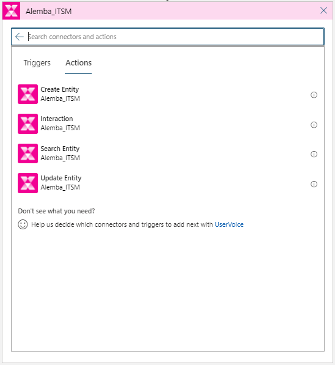
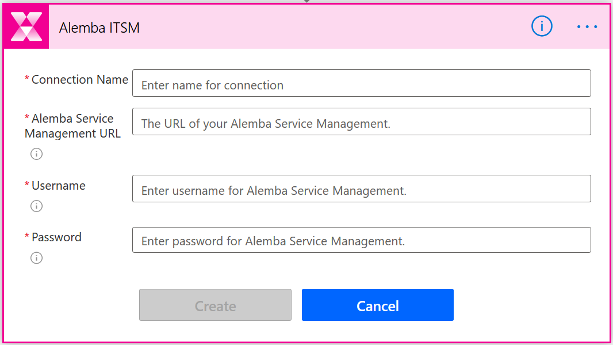
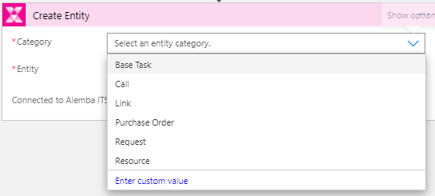
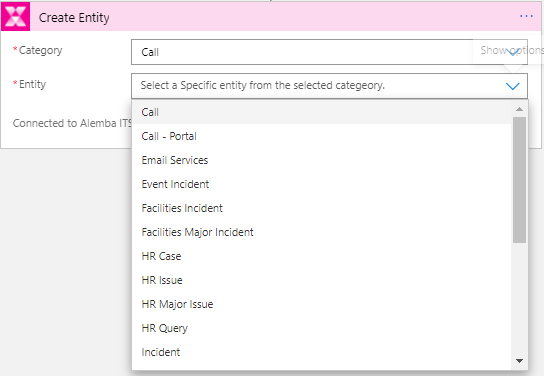
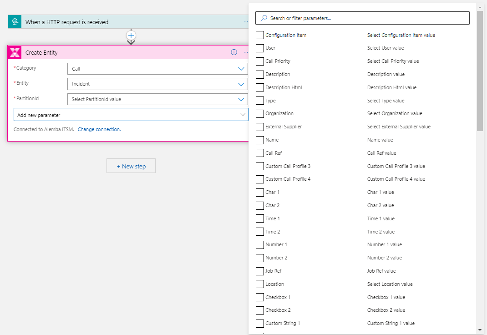
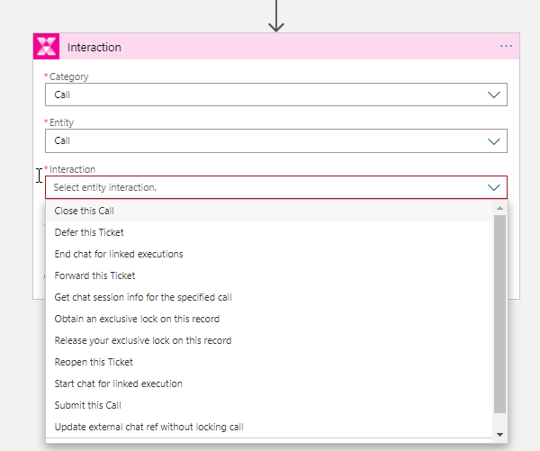

## Alemba Service Manager

Alemba Service Manager is a highly functional 100% ITIL-compliant IT and Enterprise Service Management tool with a specific focus on request fulfilment and automated workflow using a low code, no code approach.
The Alemba ITSM connector is Alemba’s integration to Logic Apps and the Power Platform. To use this integration, users must have an active Alemba Service Manager (ASM) instance. The connector allows easy access to all your Call, Request, CMDB, Knowledge, Service Levels information and the ability to interact with your ASM instance using all the available API Actions.

## Prerequisites

You will need an Alemba Service Manager instance and an analyst account to be able to use this connector and build workflows or logic using it.

## How to get credentials?

* Send a message to [info@alemba.com](mailto:info@alemba.com "info@alemba.com"), our team will get back to you with access details.
* Once you have access to your Alemba Service Manager instance, you’ll be able to connect to the Alemba ITSM connector using a configured Analyst account.

## Known issues and limitations

* Updating CMDB Links and Stakeholders is not yet supported through the Alemba API. These features are currently on our roadmap.
* Please feel free to get in touch with us at [info@alemba.com](mailto:info@alemba.com "info@alemba.com") to tell us more about your business requirements.

## Supported Actions

* Create Entity : Create any of the Alemba Service Manager Entities.
* Interaction : Each entity has a number of interactions that you can perform on it such as closing, deferring, forwarding, reopening and submitting.
* Search Entity : Search for any of the Alemba Service Manager Entities using a set of search parameters (criteria).
* Update Entity : Update, add a note or attachment to an Alemba Service Manager entity.

## Sample Usage

The Alemba ITSM connector is used in the same way for Logic Apps and Power Apps and allows you to choose the supported action or trigger:  
  
Make sure you create a connection to your ASM instance and specify the analyst credentials to connect with:  
  
You then select the Category e.g. Call:  
  
And then the Entity e.g. Incident:  
  
If Partitioning is used then you are able to define the partition value and then select which parameters (ASM Fields) you wish to populate:  
  
If you have chosen an Interaction then you can choose which ASM action you want to perform:  
  
When performing an Interaction you must add an additional step to Submit the action in order for it to be processed by the Alemba API.
