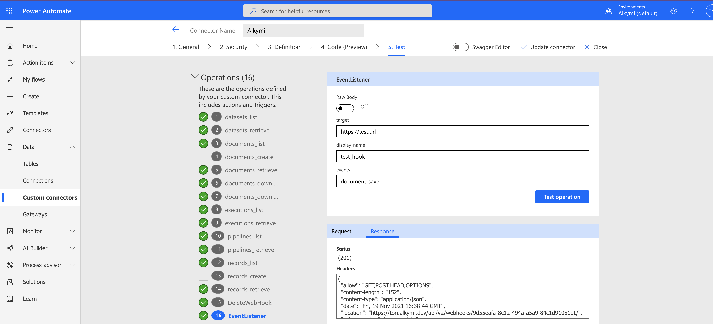
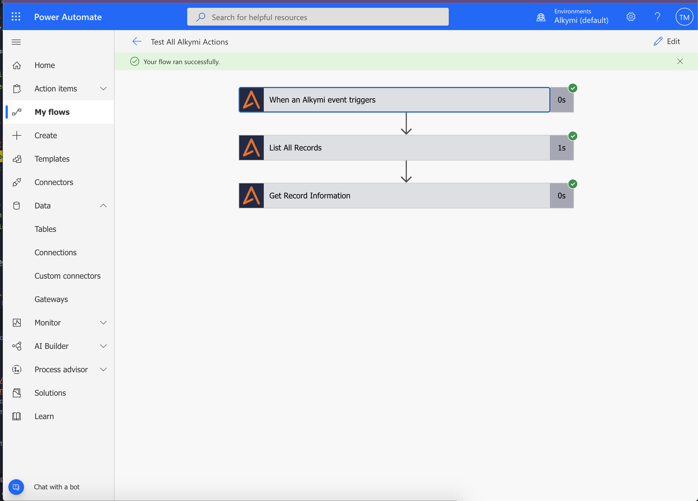

## Alkymi Connector

Alkymi transforms enterprise workflows by placing machine learning and automation technology into the hands of business 
users, turning operational data headaches into a source of efficiency. Alkymi’s core products—Data Inbox and Patterns—
allow businesses to extract, analyze, and take action on critical business data in emails and documents.

The Alkymi connector allows you to easily access the data extracted from unstructured documents processed by the Alkymi 
app. This connector will allow you to easily pipe data from the external API to any of the apps in the Microsoft 
PowerApps ecosystem.

## Publisher

Alkymi (https://www.alkymi.io/)

## Prerequisites

You will need to have an active `alkymi.io` domain and API key to leverage this connector. 

https://github.com/microsoft/PowerPlatformConnectors.git

## Building The Connector

Once you have your alkymi.io account configured, you can navigate to the `{YOUR_DOMAIN}alkymi.io/admin` page to create 
and / or access your API key. Once you have the required login information, you can deploy the sample connector by 
running the following command:

```paconn create --api-def apiDefinition.swagger.json --api-prop apiProperties.json```  

## Supported Operations
#### Triggers
- `When an Alkymi event triggers`: This trigger is executed when any of the selected Alkymi events occur. When a 
document is submitted to Data Inbox, it is first uploaded and then processed by the system. A document may, at rare 
time, error out upon processing. A user then has the ability to mark the document as reviewed or removed from the UI. 
The user can also create, modify, or delete specific records within a document and save the changes.
    - `on_execution_upload_start`: triggers on new document upload.
    - `on_execution_processing_start`: triggers on successful uploads that have begun processing.
    - `on_execution_processing_complete`: triggers on processing completion.
    - `on_execution_review_status_change`: triggers on change in document review status and subsequent save.
    - `on_execution_remove_status_change`: triggers when a document is marked or unmarked as reviewed.
    - `on_execution_error`: triggers on processing error.
    - `document_save`: triggers on document save, regardless of changes to document.
    - `record_create`: triggers on manual record creation and subsequent save.
    - `record_delete`: triggers on record deletion and subsequent save.
    - `record_modified`: triggers on alteration of record field data and subsequent save.
    
#### Actions
- `List All Datasets`: Lists all of the datasets available on the tenant. 
  [Documentation Reference](https://alkymi-api.readme.io/reference#get-dataset-list)
- `List All Documents`: Lists all of the documents available on the tenant.
  [Documentation Reference](https://alkymi-api.readme.io/reference#get-document-list)
- `List All Executions`: Lists all of the executions available on the tenant.
  [Documentation Reference](https://alkymi-api.readme.io/reference#get-execution-list-1)
- `List All Records`: Lists all of the executions available on the tenant. For example, you can return all records for a
   specific pattern if the tenant is configured with multiple patterns.
  [Documentation Reference](https://alkymi-api.readme.io/reference#records-api-v2)
- `Get Document File (Original Format)`: Downloads a copy of the document file posted to Data Inbox in its original 
  format.
- `Get Document File (PDF Format)`: Downloads a copy of the document file posted to Data Inbox in a converted PDF 
  format.
- `Get Dataset Information`: Retrieve a specific dataset instance. The returned dataset record may require additional 
  parsing before using downstream in the workflow.
  [Documentation Reference](https://alkymi-api.readme.io/reference#get-dataset-list-1)
- `Get Pattern Information`: Retrieve a specific pattern instance. The returned pattern record may require additional 
  parsing before using downstream in the workflow.
- `Get Document Information`: Retrieve a specific document instance.
  [Documentation Reference](https://alkymi-api.readme.io/reference#get-document-detail)
- `Get Execution Information`: Retrieve a specific execution instance.
  [Documentation Reference](https://alkymi-api.readme.io/reference#get-execution-list)	
- `Get Record Information`: Retrieve a specific record instance. The returned record object may require additional 
  parsing before using downstream in the workflow.
[Documentation Reference](https://alkymi-api.readme.io/reference#get-record-detail)
- `Upload Document File`: Uploads a file to a Data Inbox tenant for processing.

## Test Screenshot


 ## Successful Run Screenshot
