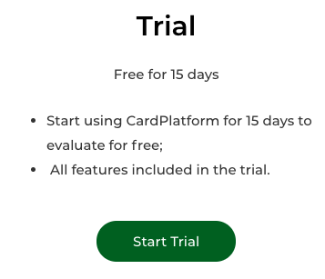
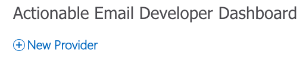
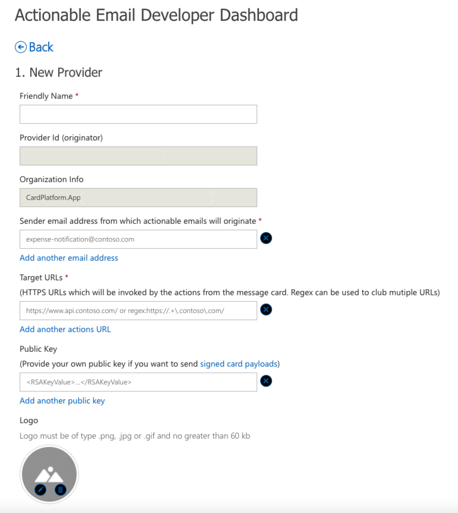
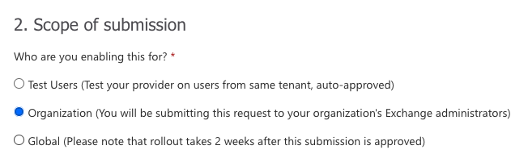
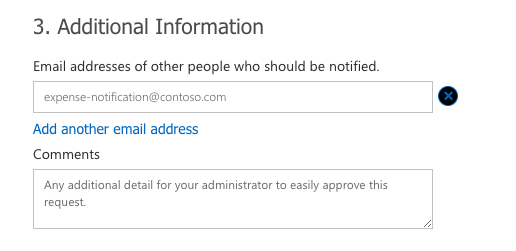

## CardPlatform Adaptive Card Connector
Card Platform allows you to send Adaptive Cards to users. Can be used for actional content, such as approvals, forms capture, and general messaging. It supports templating and custom cards.

## Prerequisites
You will need to have the following in order to proceed:
* Select or setup an email address which the Adaptive cards will be sent from in your organisation, eg card@contoso.com;
* Register to receive adaptive cards with the actionable email developer dashboard;
* CardPlatform subscription. Use the trial plan to test.

The environment requirements are:
* A Microsoft Power Apps or Power Automate plan with custom connector feature;
* An Azure subscription;
* The Power platform CLI tools.

## Get a CardPlatform subscription
To obtain a CardPlatform subscription, including a Trial to test with, navigate to:
https://cardplatform.app/plans/

Select the **Trial** plan:



After completing the form, an email will be sent to the address with instructions, and the following instructions on registering with the Actionable Email Developer Dashboard.


### Registering with the Actionable Email Developer Dashboard
To register with the Actionable Email Developer Dashboad, which allow emails to be sent, follow the steps below:

1. Navigate to the Actionable Email Developer Dashboad at https://aka.ms/publishoam
2. On the dashboard, click Add New Provider

3. On the first section of the form, *New Provider*, enter the following details:

   1. Friendly Name: **CardPlatform**
   2. Sender email address: **card@cardplatform.app**
   3. Target URLs: **Enter the following url:
   https://cardplatform.azure-api.net**
   4. Public key: **Insert the public key provided from the email**;
   5. Logo: **Use the logo from https://cardplaform.app/logo**
4. On the second section of the form, *Scope of Submission*, select **Organization**
    
5. On the third section of the form, *Additional Information*, enter:
   
   1. Additional Email addresses: **Enter any other users who should be notified about this actionable email dashboard submission**
   2. Comments: **Add any comments for the Exchange administrator to approve the request**

### Deploying the sample
Run the following commands and follow the prompts:

First, login to your PowerPlatform
```
paconn login
```
Then create the new custom connector:

```paconn
paconn create --api-def apiDefinition.swagger.json --api-prop apiProperties.json --icon ./icon.png
```

## Supported Operations
The connector supports the following operations:
* `Send Message`: Sends an Adaptive Card as a message (no actions)
* `Send Card`: Sends an Approval Adaptive Card, and returns the response with the choice and fields entered
* `Send Approval`: Sends an Approval Adaptive Card, and returns the response with the choice and fields entered
* `Get a public template`: Retrieves the contents of a public template
* `Find a public template`: Find a public template by analyzing the structure of your data.
* `Transform public template`: Populates a public template with the data and returnes a fully populated Adaptive Card
* `List public templates`: Retrieves a list of all public templates
* `Get a private template`: Retrieves a private template by name
* `Delete private template`: List all versions of the specified secret
* `Create a private template`: Create a new private templateecified secret version from a given key vault
* `Update a private template`: Updates the contents of a private template
* `List private templates`: Retrieves a list of all private templates
* `Transform private template`: Populates a private template with the data and returnes a fully populated Adaptive Card