## Docurain Connector
Docurain connector provides an API to generate Documents (e.g. PDF, Excel, etc...).
This API allows you to create your own Document using a template file registered in Docurain and data in PowerApps.

## Prerequisites.
To proceed, you will need the following.
* Create a Account Docurain `https://docurain.jp/signup/`
* Create an access token from Docurain console screen 
  The access token is an API key for the custom connector "Docurain". Please set an expire and an allowed IP address with this in mind.

## Downloading & Deploying the Connector
1. Clone the PowerPlatformConnectors GitHub repository
2. Open a terminal, then change to the `Docurain` directory
3. Run `paconn login`, then follow the authentication steps
4. Once authenticated, run `paconn create --api-def apiDefinition.swagger.json --api-prop apiProperties.json`
5. Select the target environment for your connector

## Create Connection
Create a new connection using your API Key. 
The Access token you created in the Docurain console screen will be your API Key. 
`token [access_token]`

## Supported Actions
The Acuity Scheduling sample connector currently supports the following actions:
* `Render`: Render a Document(Report, Form) by specifying the name of a template saved in Docurain beforehand.
* `RenderAsync`: Render a Document(Report, Form) asynchronously by specifying the name of a template saved in Docurain beforehand.
* `GetAsyncStatus`: Get the processing status of rendering with the result ID returned from RenderAsync.
* `GetAsyncResult`: Get the rendering result with the result ID returned from RenderAsync.

## Sample Usage
### PowerApp
* **Displays Docurain-rendered PDFs in PDFViewer based on the input values (json) from the screen and the "sample" templates previously registered in Docurain.**
  1. Setting the OnSelect button. 
    `Docurain.Render("[output format]", "[template name]", "[data format]", "[JSON with any properties]")` 
    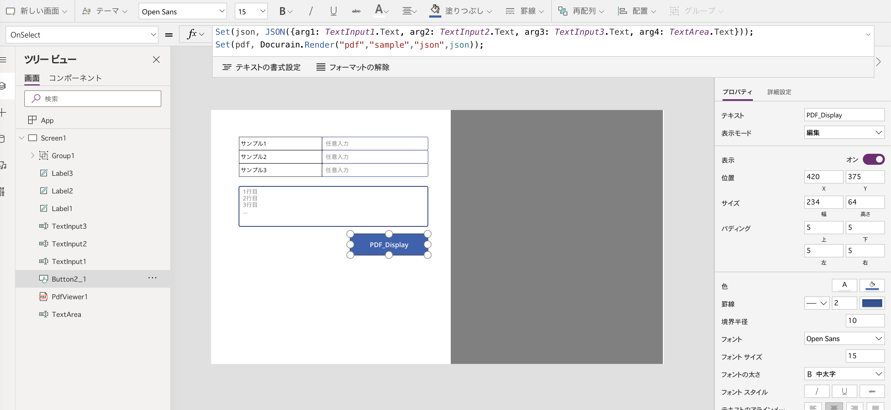. 
  2. PDFViewer settings 
    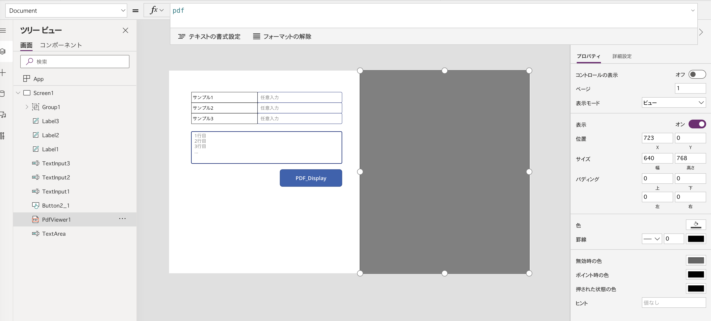. 
  3. Input value in each field and click the button. The result is displayed in PDFViewer. 
    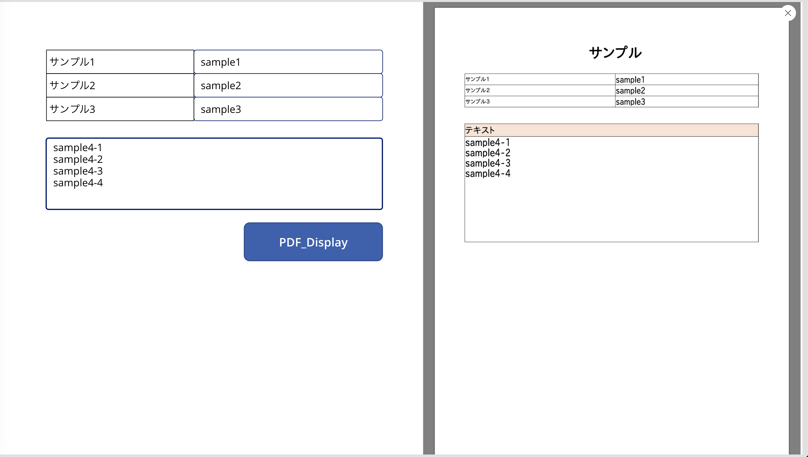. 

### PowerApp And Flow
* **Download a Docurain-rendered PDF based on the input values (json) from the screen and a "sample" template previously registered in Docurain.**
  1. Setting the OnSelect button. 
    Determine the result returned from `DourainRender`, download the file or display the message. 
    `DourainRender` is Sample Flow. `DourainRender` will be explained in the following sections. 
    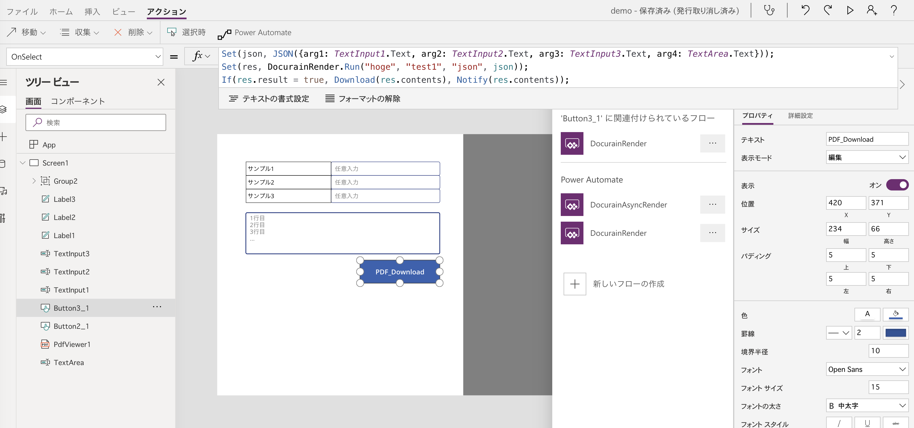 
  2. Flow in Power Automate 
    `DourainRender`(sample) 
    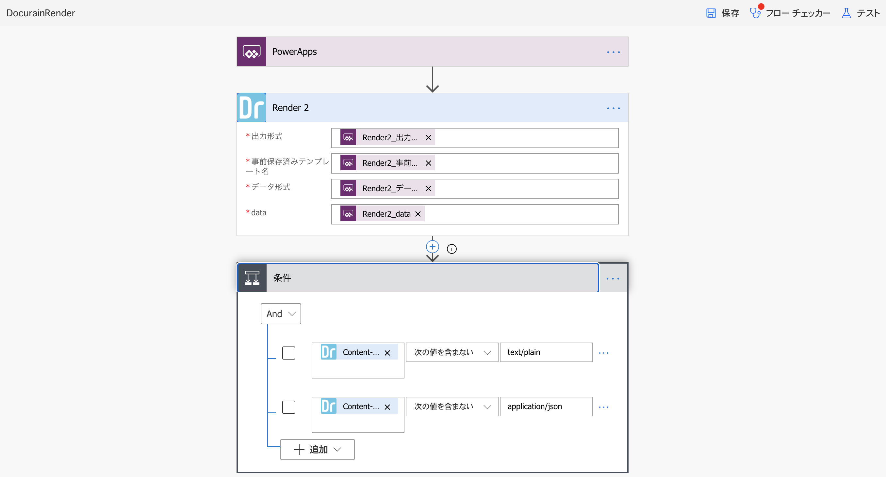 
    Temporarily save the Docurain output PDF to OneDrive and respond to PowerApp with the URL of the file. In case of an error, the response of the API is JSON, so it responds with a body. 
    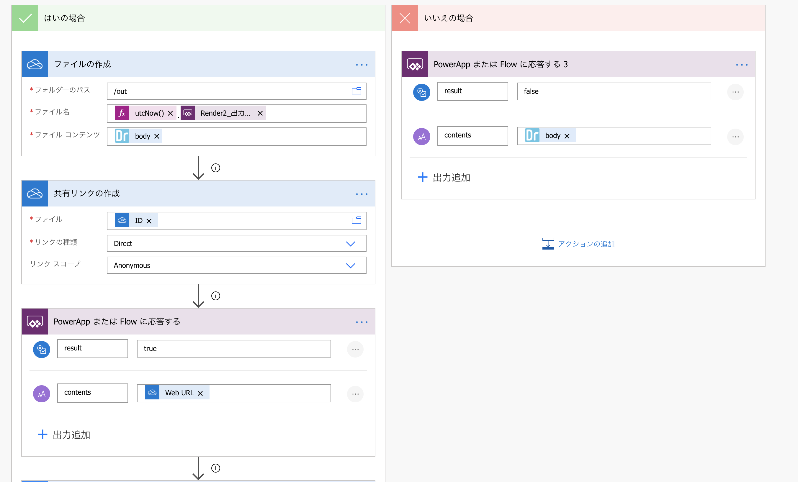 
    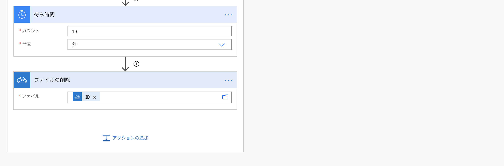 
  3. Input a value in each field and click the button to download the PDF. 
    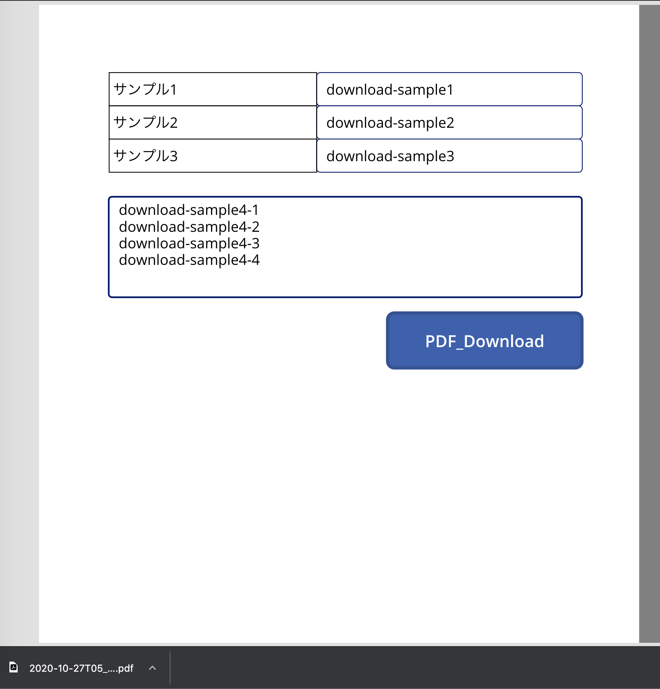 

* **If Render times out due to large data or output results, use RenderAsync to avoid it.**
  1. Setting the OnSelect button. 
    Determine the result returned from `DourainRenderAsync`, download the file or display the message. 
    `DourainRenderAsync` is Sample Flow. `DourainRenderAsync` will be explained in the following sections. 
    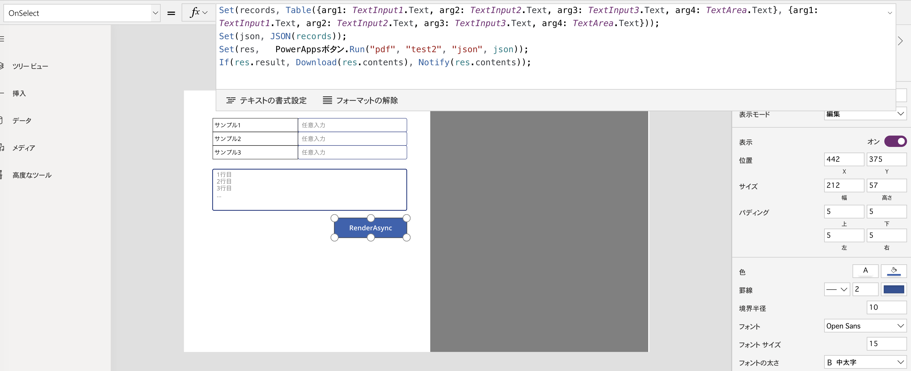 
  2. Flow in Power Automate 
    `DourainRenderAsync`(sample) 
    **If you want to use it in the actual flow, add a step to determine the response of each API.** 
    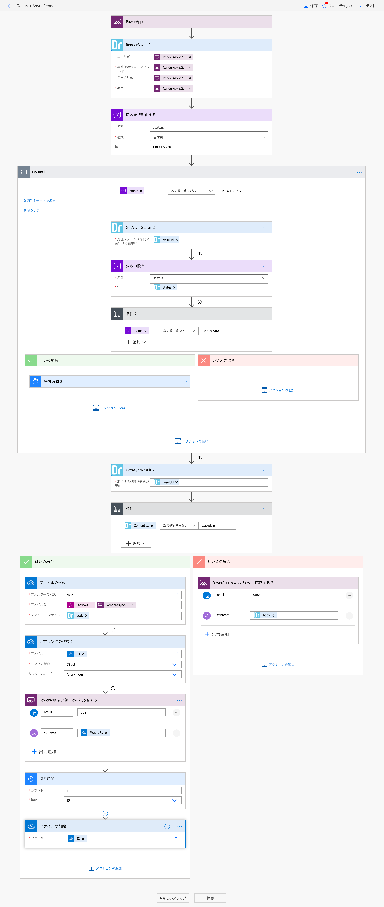 
  3. Input a value in each field and click the button to download the PDF. 
    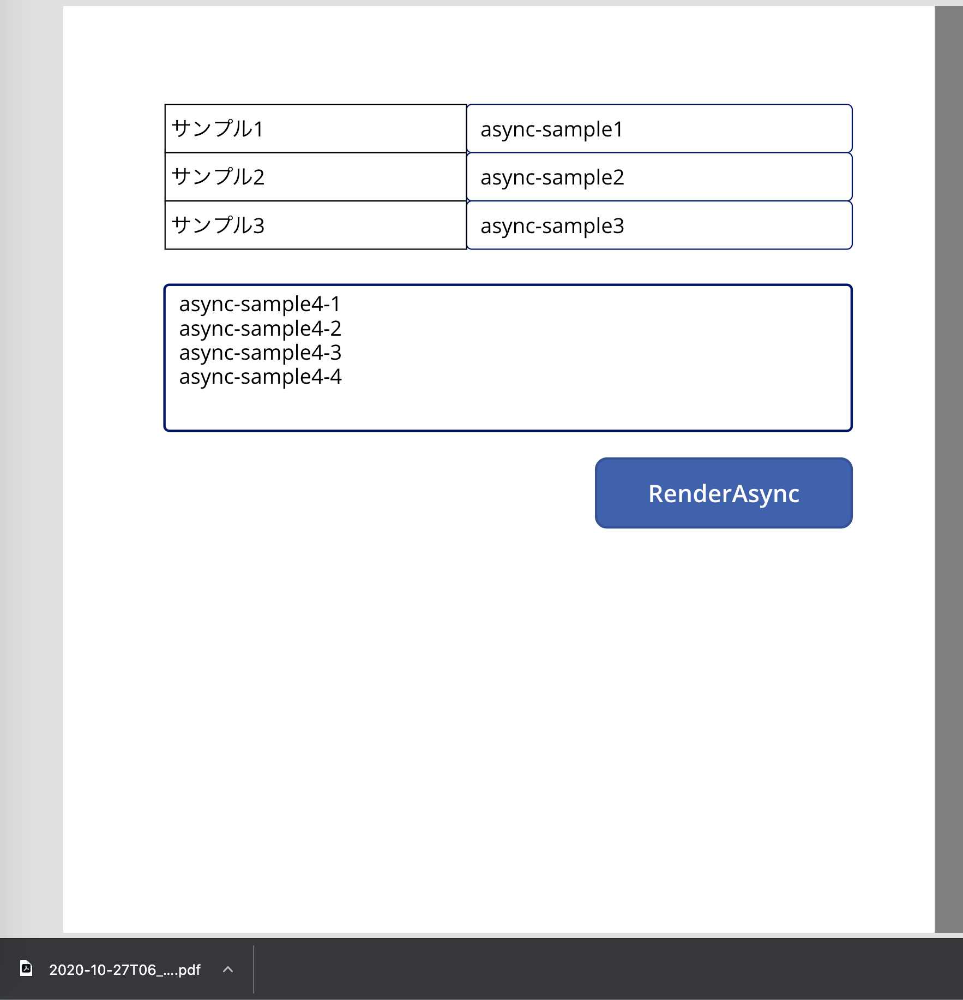 

## Further Support
* Login to the Docurain console screen and connect to the following URL.
  `https://api.docurain.jp/console/inquiry`
* Please send your inquiry with the title and content of your inquiry.
