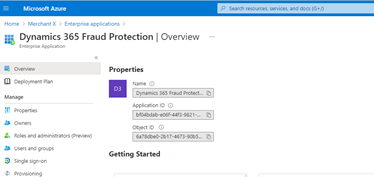
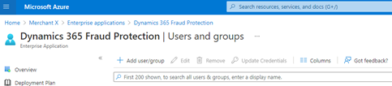
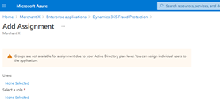
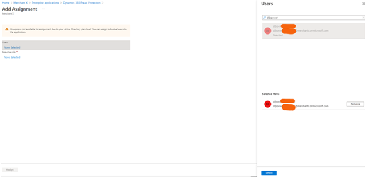
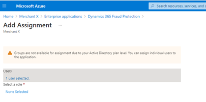
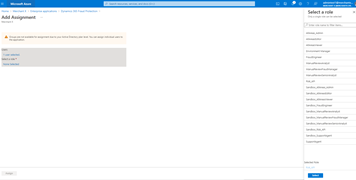
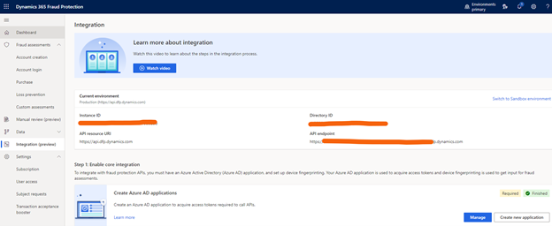

# Title

Microsoft Dynamics 365 Fraud Protection provides merchants the capability to assess e-commerce transactions for fraudulent activity, if the risk of attempts to create new accounts and attempts to log in on merchant’s ecosystem are fraudulent

## Publisher: Publisher's Name

Microsoft

## Prerequisites

To use this connector you need to have Dynamics 365 Fraud Protection provisioned. You can find instructions on the following link: https://docs.microsoft.com/en-us/dynamics365/fraud-protection/

## Supported Operations

The connector supports the following operations:

- `Account Creation`: Send information and context about an incoming new Account Creation attempt and gets a response that contains potential likely risk level and your rule decision for the Account Creation.
- `Account Creation Status`: Send an update of the status of an Account Creation, for example, if the Account Creation has been canceled. This is a data ingestion event only.
- `Account Login`: Send information and context about an incoming new Account Login attempt and gets a response that contains potential likely risk level and your rule decision for the Account Login.
- `Account Login Status`: Send an update of the status of an Account Login, for example, if the Account login has been canceled. This is a data ingestion event only.
- `Account Update`: Send updates or creates user account information, for example, Add Payment Instrument, Add Address, or any other user attribute. This is a data ingestion event only.
- `Purchase`: Send information and context about an incoming new purchase transaction. The response contains a decision to either approve or reject the purchase transaction based on your rules.
- `Purchase Status`: Get a specified secret from a given key vault
- `Bank Event`: Send information if a purchase transaction sent to the bank was approved or rejected for bank authorization or bank charge/settlement. This is a data ingestion event only.
- `Refund`: Send information about a previous purchase transaction being refunded. This is a data ingestion event only. Many merchants send these events using bulk data upload.
- `Chargeback`: Send information about a previous purchase that the customer disputed with their bank as fraud. This is a data ingestion event only. Many merchants send these events using bulk data upload.
- `Purchase Update Account`: Send updates or creates user account information, for example, Add Payment Instrument, Add Address, or any other user attribute. This is a data ingestion event only.
- `Label`: Send an update of the label. This is a data ingestion event only.
- `Custom Assessment`: Send a structure of your own choosing, triggered by conditions of your own choosing for rule-evaluation and gets a response that contains a decision for the event.

## Obtaining Credentials

Required. Explain the authentication method and how to get the credentials.​

This connector supports both user account and service principal authentication. Typical this connector is called from Power Automate and in Power Automate, you need to configure authentication.

### User Account Authentication

1. Create a new user using this [link](https://docs.microsoft.com/en-us/azure/active-directory/fundamentals/add-users-azure-active-directory#add-a-new-user)

2. Assign the new user to Risk_Api role in Dynamics 365 Fraud Protection Application.

   - Go to "Enterprises applications" in Azure Active Directory. Select "Microsoft Applications" as Application Type and type "Dynamics 365 Fraud Protection" in the search

   

   - Click on "Dynamics 365 Fraud Protection"

   

   - Click on "Users and groups" - Click on "Add user/group"

   

   

   - Click on Users, enter the user name and the select the user name

   

   

   - Click on 'Select a role', click on "Risk_Api role and click on "Select" - Click on Assign

   

   

### Service principal

- Assign the new user to Risk_Api role in Dynamics 365 Fraud Protection Application.

  - Browse to https://dfp.microsoft.com/
  - Click on "Integration (preview)"
  - Click on "Create new application" in "Step 1: Enable core integration"

    

  - Enter Application display name, select secret option and click on "Create application"
  - In the next screen, copy application (client) ID and Client secret. You need to use these values to configure the connector connection.

## Host Url

This connector requires host url. You can find the host url in https://dfp.microsoft.com

- Browse to https://dfp.microsoft.com/

  - Click on "Integration (preview)"
  - Set the host url with API endpoint value

  

## Deployment Instructions

Required. Add instructions on how to deploy this connector as custom connector.
