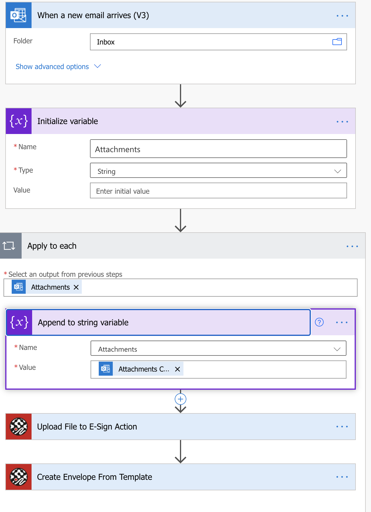

## E-Sign
It’s easy to e-sign and send your documents on any device with our secure electronic signature system.

## Prerequisites

In order use this connector you must have a paid for E-Sign account on the E-Sign platform. You can setup an account here https://www.e-sign.co.uk/register. 

How to get credentials

The E-Sign API uses OAuth 2 to authenticate so once account is setup no additional steps are required.

## Getting started with your connector

* Upload a file to E-Sign: This action takes a base64 string and uploads it the E-Sign platform
* Create a document from template: This action creates a new document, using the selected template.

Send a document for signing when a new email with an attachment is received from Microsoft Outlook or Gmail as shown below. 


## Known issues and limitations

In order for the upload function to work currently a String variable must be initialised and then declared. This is shown in the example above, this will allow a document to be uploaded to the E-Sign platform, and then be used for the new document. 

API documentation

https://api.e-sign.co.uk/v3/index.html 

## FAQ

https://www.e-sign.co.uk/support/faqs/ 
https://www.e-sign.co.uk/contact-us/ 

