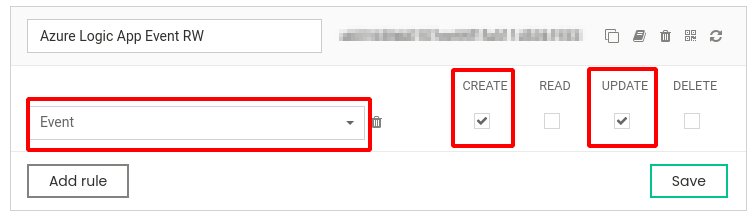
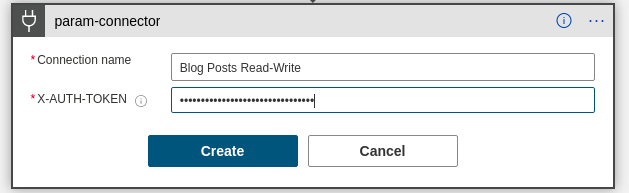
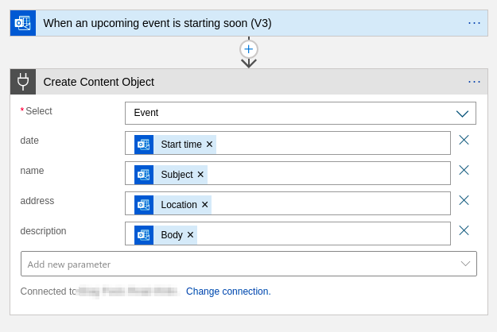

Flotiq connector
================

[Flotiq](https://flotiq.com) is an API-first, headless Content Management System which allows users to easily publish their content through APIs that are dynamically built to support the current content model. You can use Flotiq to store content and consume it in any kind of system. We provide a variety of simple, low-code (or no-code) solutions to integrate systems with Flotiq in order to efficiently work with data. This connector allows you to easily integrate your Microsoft services with Flotiq and exchange data between systems with very little effort.

## Prerequisites

You will need the following to start using the connector:
- Flotiq subscription (you can [register a free Flotiq account here](https://editor.flotiq.com/register.html))
- At least 1 Content Type Definition defined in Flotiq
- At least 1 API key which allows access to the Content Type Definition
- A Microsoft Power Apps plan or
- Microsoft Azure subscription for building Logic Apps.

## Getting started

1. To use the connector you first need to create a Content Type Definition (CTD) inside Flotiq. You will find detailed information on how to do it in the [Creating Content Type Definitions](https://flotiq.com/docs/panel/content-types/#creating-content-type-definitions) section of documentation. If you'd like to get started quickly - you can try one of the pre-defined types, like "Event":
   
2. Once you created the CTD - you will need an API key to allow the connector to access data in your Flotiq instance. You can find detailed information on [creating scoped API-keys](https://flotiq.com/docs/API/#user-defined-api-keys) in our documentation. We recommend to create a scoped key and restrict its access only to the operations strictly required for this particular connector to work - for example Create & Update permissions on the Event content type. 
   
3. Once the API key is created - please copy the key, it will be used to authorize the connector.

## Enabling the connector in Logic Apps

1. You can easily enable the connector in Logic Apps - just search for Flotiq in the connector database. Authorize the connection to your Flotiq system by pasting the API key copied from Flotiq. 
   
2. Select the `Create Content Object` action to feed data into Flotiq. Once selected, please select the Content Type Definition name from the first Select field. After that is selected - the form will automatically expand to display all the attributes of the CTD.
   
3. You can now continue designing your Logic App - as usual.