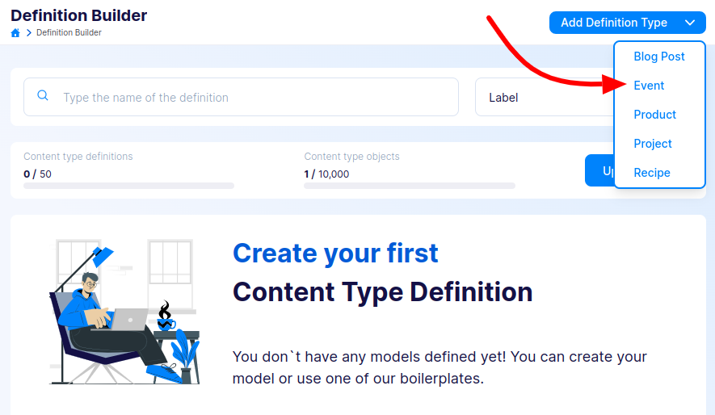
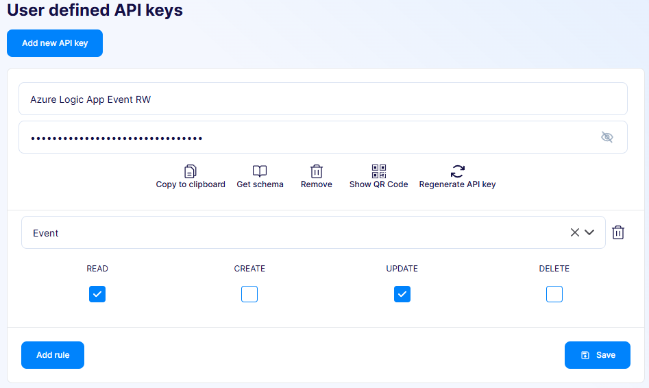
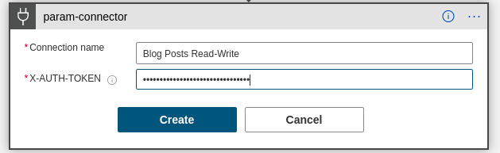
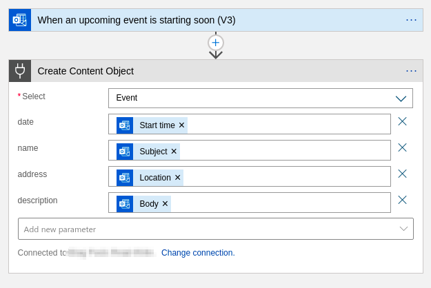

# Flotiq Connector for Microsoft Power Platform

[Flotiq](https://flotiq.com) is an API-first, headless Content Management System (CMS) that enables developers and content creators to manage and publish content through automatically generated REST APIs. It supports low-code and no-code integrations across various platforms.

This connector lets you easily integrate Flotiq with Microsoft services such as **Power Apps**, **Logic Apps**, or **Power Automate**, allowing seamless data flow between Flotiq and other systems.

---

## Prerequisites

Before you begin, make sure you have:

- A [Flotiq account](https://editor.flotiq.com/register?plan=1ef44daa-fdc3-6790-960e-cb20a0848bfa?utm_campaign=flotiq_powerapps_connector&utm_medium=referral&utm_source=microsoft) (free plan available)
- At least one **Content Type Definition (CTD)** created in Flotiq
- An API key with access to the CTD
- Access to Microsoft Power Apps or a Microsoft Azure subscription (for Logic Apps)

---

## Getting Started

1. **Create a Content Type Definition in Flotiq**  
   Follow the guide in [our documentation](https://flotiq.com/docs/panel/content-types/#creating-content-type-definitions) or start with a ready-made example like `"Event"`:

   

2. **Generate a scoped API key**  
   Navigate to the API Keys section in Flotiq and [create a new key](https://flotiq.com/docs/API/#user-defined-api-keys).  
   We recommend limiting its scope to only the CTD and operations (e.g., Create, Update) required by the connector.

   

3. **Copy the API key**  
   You'll use this key to authorize requests from Power Platform to Flotiq.

---

## Using the Connector in Logic Apps

1. **Find and authorize the connector**  
   In Logic Apps, search for "Flotiq" among available connectors.  
   Paste your API key when prompted to authorize the connection.

   

2. **Use the `Create Content Object` action**  
   Choose your target Content Type Definition from the dropdown.  
   Once selected, a dynamic form will appear, letting you map all the CTD’s fields.

   

3. **Continue building your Logic App**  
   You can now connect Flotiq with other Microsoft services in your workflow.

---

Got questions? Visit [flotiq.com](https://flotiq.com) or reach out via our support channels.
