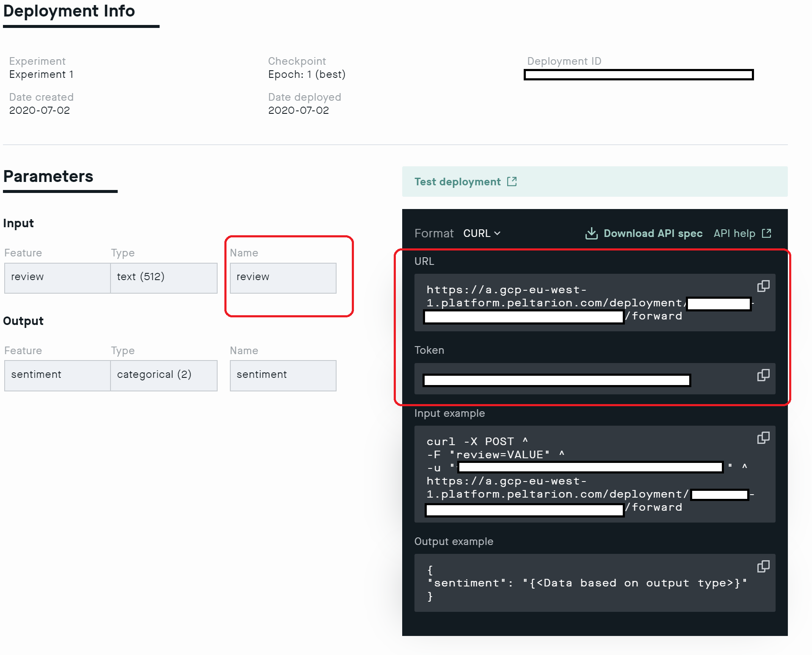

# Peltarion Connector

Use deep learning in your apps! Peltarion allows for powerful yet simple & fast ways to create smart applications, work with deep learning modeling and operationalize AI. This Peltarion connector lets you build and deploy advanced AI models and connect to Power Platform through the API. 

## Powerful examples
The Peltarion connector can let you build AI-powered apps that: 
- Can tell the difference between music genres and classify them accordingly ([link](https://bit.ly/34K98Sm))
- Understands the semantic meaning of words and use it to classify movie reviews or customer support messages ([link](https://bit.ly/3jrkZsP))
- Label images as per the clothing category they belong to (say in an e-commerce catalog) ([link](https://bit.ly/3lqyiLD))
- Predict the value and price of houses you’re looking to buy ([link](https://bit.ly/3b6CTht))

## Getting started

1. Sign up for free on the Peltarion Platform ([link](https://bit.ly/3llPmTf))
2. Build, train and deploy your AI model on the Peltarion platform
3. Add the Peltarion connector to your app. Enter the URL and token for your build model (see image below)


Peltarion's Power Platform connector currently supports 2 operations:
1. *callapi* (used to call conventional models) and
2. *calltextsim* (used to call text similarity models). 

To use the connector you can call the API with this snippet:

```
ClearCollect(dd, {<YOUR-INPUT-PARAM>: TextInput1.Text});
Set(jdata, JSON(dd, JSONFormat.IncludeBinaryData));
Set(res, PeltarionAI.callapi(jdata))
```

**Explaination of the snippet** \
The *ClearCollect* method creates an array assigned to the variable *dd*.  The *JSON* method creates a JSON object from *dd* which is assigned to the variable *jdata* using the *Set* method. If `<YOUR-INPUT-PARAM>` is "name" and the text in *TextInput1* is "John Doe", the above snippet sends a get request (through a midlayer) to the Peltarion Deployment API with *jdata* as `{[{"name": "John Doe"}]}`, according to the structure expected by the API. The response object from Peltarion's Deployment API is assigned to the variable *res* by the *Set* method. The snippet then returns *res*, an object with three entires:

- *key* is the name of the predicted class. For regression problems, the *key* is always "value".
- *val* is the probability of the class.
- *errorMessage* holds the error message, if any.

As for the `.calltextsim()` command you can call it with the same snippet as above by simply changing the operation from callapi to calltextsim. The response variable *res* is an object with three entries: 

- *first* is the first or closest similarity found within the data. *first* holds *text* and *distance* 
- *all* returns a *collection* of 5 similarity results and all of the them hold *text* and *distance* 
- *errorMessage* holds the error message, if any.

Your URL, token and input name is found on the Deployment view on the Peltarion Platform. See screenshot below.



For information on how to build and train an AI model on the Peltarion platform, visit our knowledge center (link: https://bit.ly/3gC6XCN)
