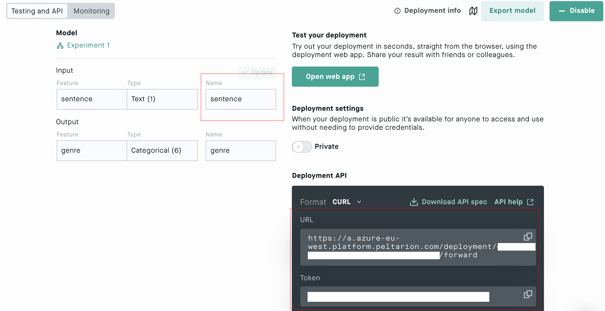

# Peltarion Connector

Use deep learning in your apps! Peltarion’s plugin is the simplest and fastest way to create smart applications. With this Peltarion integration, you can build and deploy AI models, and through the API connect to your app.

See below for some of the things you can build.

- Can tell the difference between music genres and classify them accordingly ([link](https://bit.ly/34K98Sm))
- Understands the semantic meaning of words and use it to classify movie reviews or customer support messages ([link](https://bit.ly/3jrkZsP))
- Label images as per the clothing category they belong to (say in an e-commerce catalog) ([link](https://bit.ly/3lqyiLD))
- Predict the value and price of houses you’re looking to buy ([link](https://bit.ly/3b6CTht))

## Getting started

1. Sign up for free on the Peltarion Platform ([link](https://bit.ly/3llPmTf))
1. Build and train your AI model on the Peltarion platform
1. Add the Peltarion connector to your app. Enter the URL and token for your build model (see image below)

The connector only support one operation, called *callapi*. To use the connector and store the value into a variable *res*, you can call the API like this:

```
ClearCollect(dd, { <YOUR-INPUT-PARAM>: TextInput1.Text});
Set(jdata, JSON(dd, JSONFormat.IncludeBinaryData));
Set(res, PeltarionAI.callapi(jdata))
```

The *res* is an object with three values:

- *key* is the name of the predicted class. For regression problems, the *key* is always "value"
- *val* is the probability of the class
- *errorMessage* holds the error message, if any

Your URL, token and input name is found on the Deployment view on the Peltarion Platform. See screenshot below.



For information on how to build and train an AI model on the Peltarion platform, visit our knowledge center (link: https://bit.ly/3gC6XCN)
