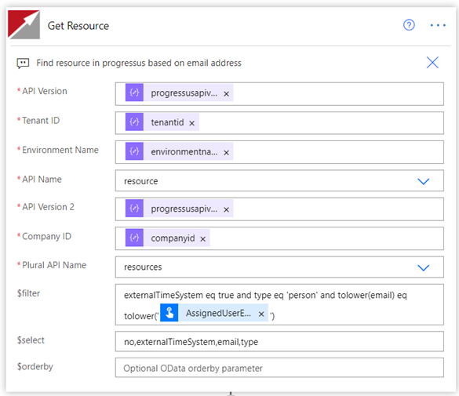
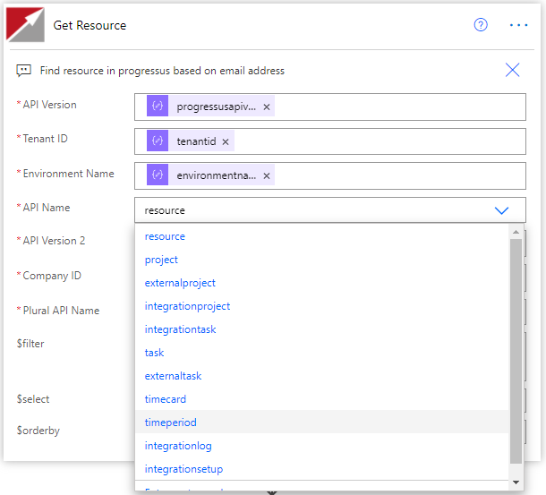

# Progressus Advanced Projects Connector

Progressus Advanced Projects provides industry capabilities at its cornerstone. Flexible project forecasting. Powerful project planning, estimating, and budgeting. Easy mobile time and expense entry. Project-focused analytics and insights. This single solution delivers the power to maximize utilization, to complete great projects on-time and on-budget, and to optimize your project portfolio. Built on Microsoft Dynamics 365 Business Central and native to the Microsoft Intelligent Cloud. One cloud, one security model, one data model, and a common user interface for all your business and productivity applications.
This Connector allows for more advanced OData queries against the Progressus Advanced Projects data than what the Business Central Connector provides.

## Prerequisites

You will need the following to proceed:

- A Microsoft Power Apps or Power Automate plan with custom connector feature
- Business Central with Progressus Advanced Projects installed
- A Business Central User with a Web Service Access Key

## How to get credentials

Generate a Web Service access key for a User in Business Central:

[https://docs.microsoft.com/en-us/dynamics365/business-central/dev-itpro/webservices/web-services-authentication#generate-a-web-service-access-key](/dynamics365/business-central/dev-itpro/webservices/web-services-authentication)

## Get started with your connector

The connector’s fields are used in the following manner to form a Business Central web service URL:

`https://api.businesscentral.dynamics.com/<API Version>/<Tenant ID>/<Environment Name>/api/progressus/<API Name>/<API Version 2>/companies(<Company ID>)/<Plural API Name>`

## Known issues and limitations

This connector is intended for use with Progressus Advanced Projects.  The dropdown of API names is restricted to tables related to Progressus Advanced Projects.

## Common errors and remedies

Most errors are likely to be caused by not having the correct syntax for the $filter, $select, and $orderby fields.  Make sure to check that proper Odata syntax is used for these field.

## Supported Operations

The connector supports the following operations:

- **Get**:  This **Get** action has dropdowns to allow selecting which Progressus Advanced Project data you would like to query as well as options for selecting fields, filtering results, and ordering the data by specified fields.
