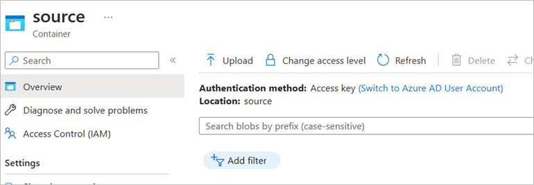

[Azure Cognitive Services Translator](https://learn.microsoft.com/azure/cognitive-services/translator/translator-overview) connector allows you to integrate any component of Power Platform such as Power Automate Flow, or Power App with our Microsoft Translator service. With this connector, you can perform the following actions:

•	Translate text.

•	Transliterate text.

•	Translate a variety of [document file types]( https://learn.microsoft.com/en-us/azure/cognitive-services/translator/document-translation/overview#supported-document-formats).

## Prerequisites

Follow instructions on [creating a Translator resource on the Azure portal]( https://learn.microsoft.com/azure/cognitive-services/Translator/create-translator-resource)

## How to get credentials

•	After creating a Translator resource, [get the resource name and key from Azure Portal]( https://learn.microsoft.com/azure/cognitive-services/Translator/create-translator-resource#get-your-authentication-keys-and-endpoint ).

•	Follow these [prerequisites for translating documents]( https://learn.microsoft.com/en-us/azure/cognitive-services/translator/document-translation/quickstarts/get-started-with-rest-api?pivots=programming-language-csharp#prerequisites). 

•	Navigate inside the source and target containers and click “Switch to Azure AD User Account” as shown in the screenshot below. This step is required only for the connector. 

 

## Get started with your connector

Follow these instructions on [how to use Translator connector in a flow](https://aka.ms/translatorconnector) and automate your translation tasks.

## Common Errors
Please refer this documentation for common errors - https://learn.microsoft.com/en-us/azure/cognitive-services/translator/reference/v3-0-reference#errors