WhoisFreaks is an advanced domain and network intelligence platform offering real-time and historical WHOIS, DNS, SSL, and subdomain data tracking, alongside IP geolocation and reputation capabilities.

## Actions

This node natively supports the following WhoisFreaks features across both single targets and bulk inputs:

### Standard Actions
* **Live WHOIS Lookup:** Retrieve current ownership registration details for a domain.
* **Historical WHOIS Lookup:** Inspect historical changes in ownership records.
* **Reverse WHOIS Search:** Query domains related to specific keywords or registrant terms.
* **Live DNS Lookup:** Fetch current A, AAAA, MX, NS, TXT, or CNAME records.
* **Historical DNS Lookup:** Uncover past adjustments to a domain's DNS structure.
* **Reverse DNS Search:** Uncover what domains resolve back to a targeted IP address.
* **SSL Lookup:** Analyze live SSL/TLS certificates and certificate trust chains.
* **Subdomains Lookup:** Discover and list all public subdomains linked to a domain.
* **Domain Availability:** Instantly verify whether a domain name is available for purchase.
* **IP Geolocation:** Trace geographical positioning variables (country, city, ASN) from an IP address.
* **IP Reputation:** Run advanced security assessment queries on IP addresses.
* **Domain Security Lookup** Check domain security if a domain is being used in any sort of malware or phishing campaign.
* **Typo Squatting Lookup** Check domain typosquatting.

### Bulk Actions
* **Bulk WHOIS Lookup:** Batch audit multiple domain registrants at once.
* **Bulk Domain DNS Lookup:** Execute massive batch transformations across a mixture of domains/IP addresses.
* **Bulk Domain Availability Lookup:** Perform scalable automated availability sweeps.
* **Bulk IP Geolocation Lookup:** Map arrays of network traffic coordinates in one call.
* **Bulk IP Reputation Lookup:** Fast-track incident response logs by batch scanning malicious assets.

---

## Credentials

To authorize your node requests, you must obtain an API Key from the service provider.

### Setting up the connection:
1. Log in or create an account via the [WhoisFreaks Dashboard](https://billing.whoisfreaks.com/).
2. Copy your unique **API Key** generated inside your account space.
3. In n8n, create a new **WhoisFreaks API** credential block.
4. Paste your key into the **API Key** parameter space and hit save.

---

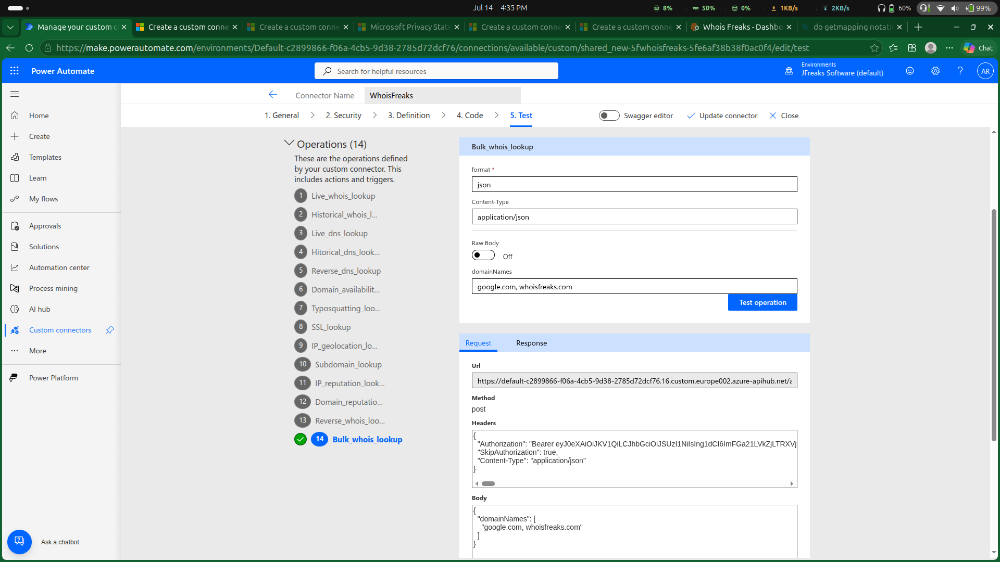
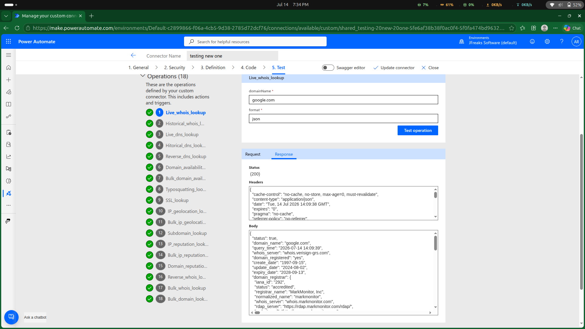
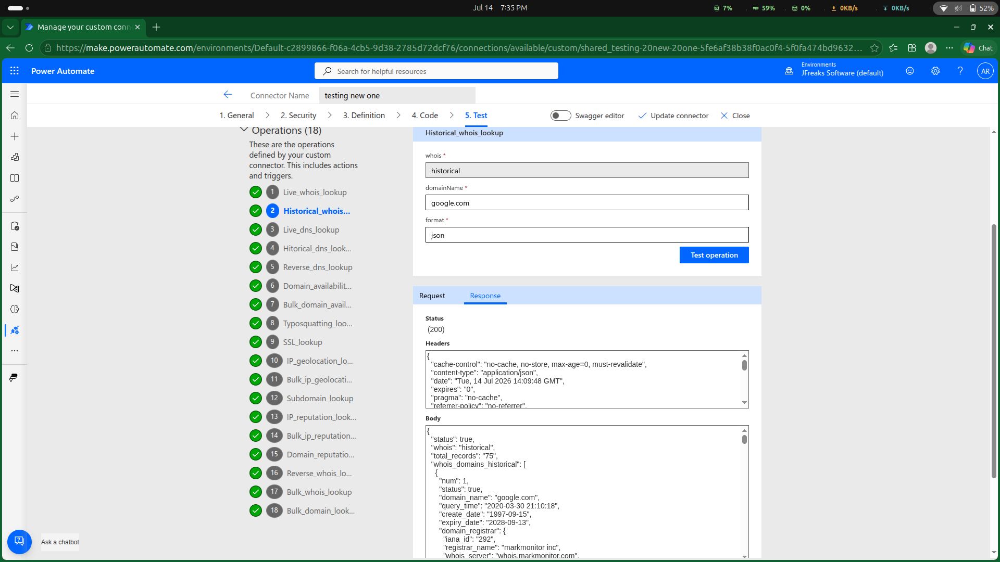
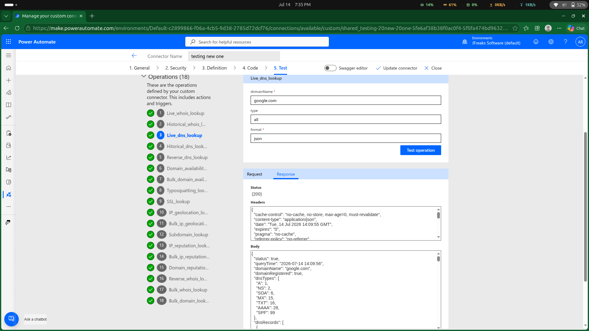
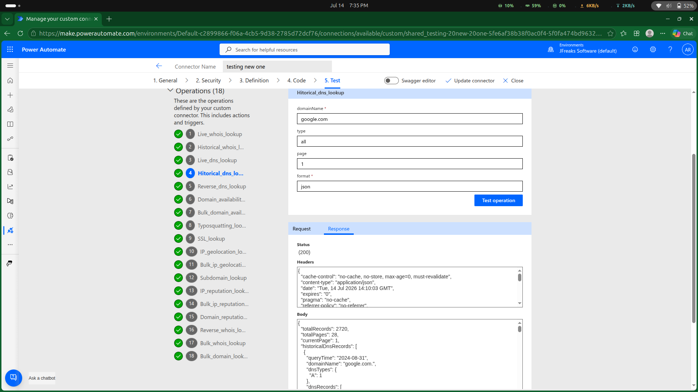
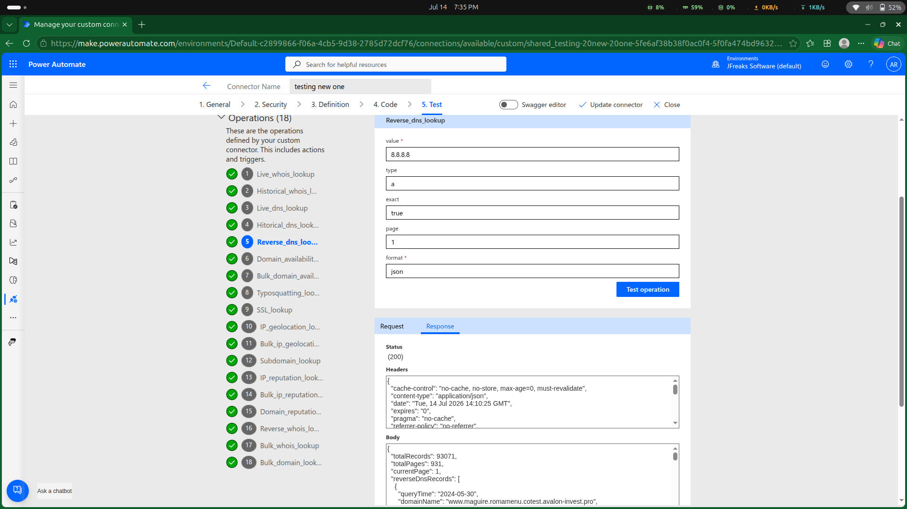
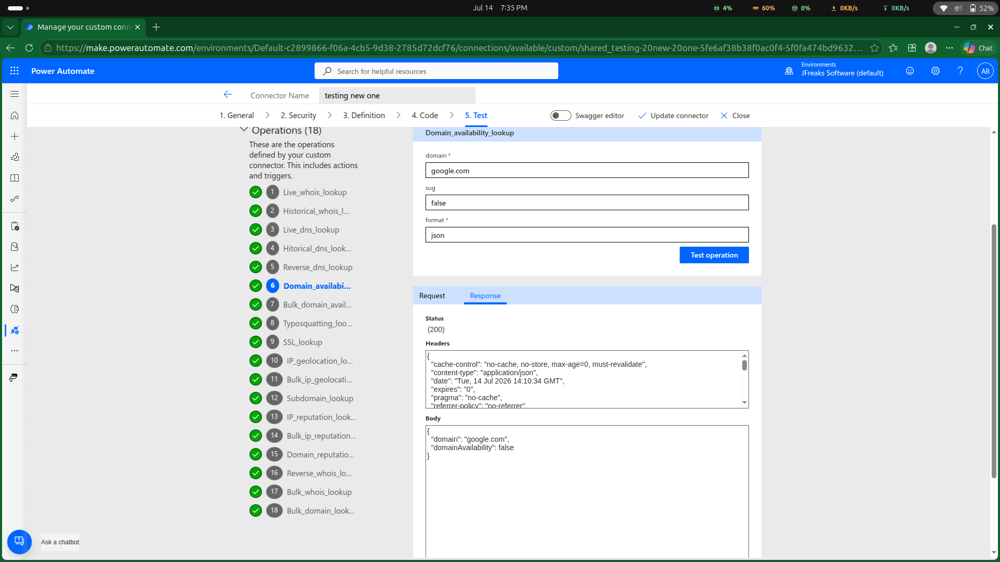
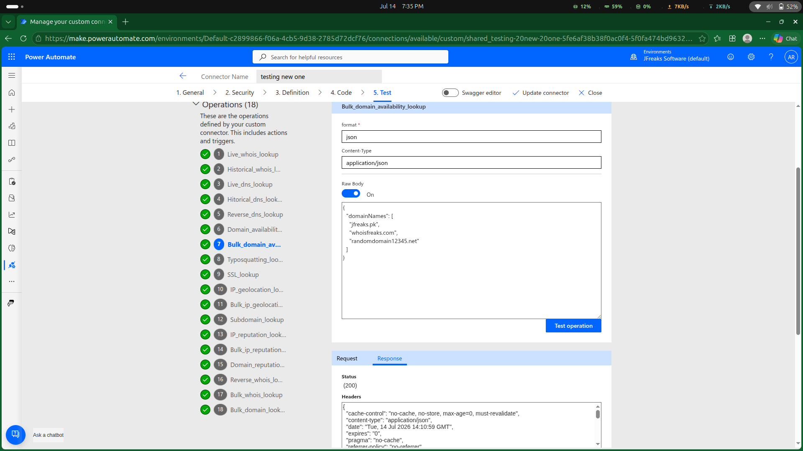
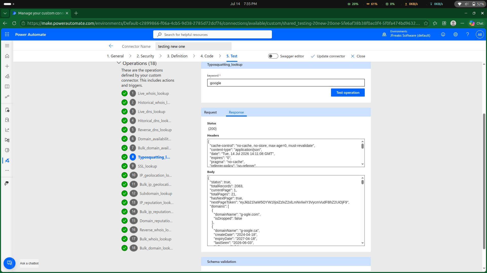
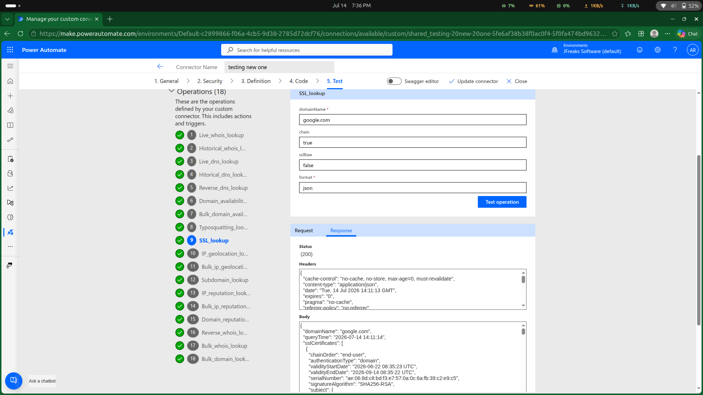

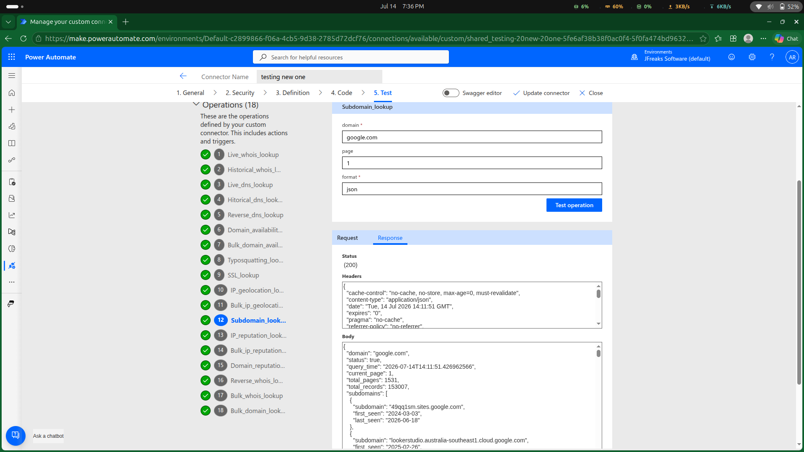
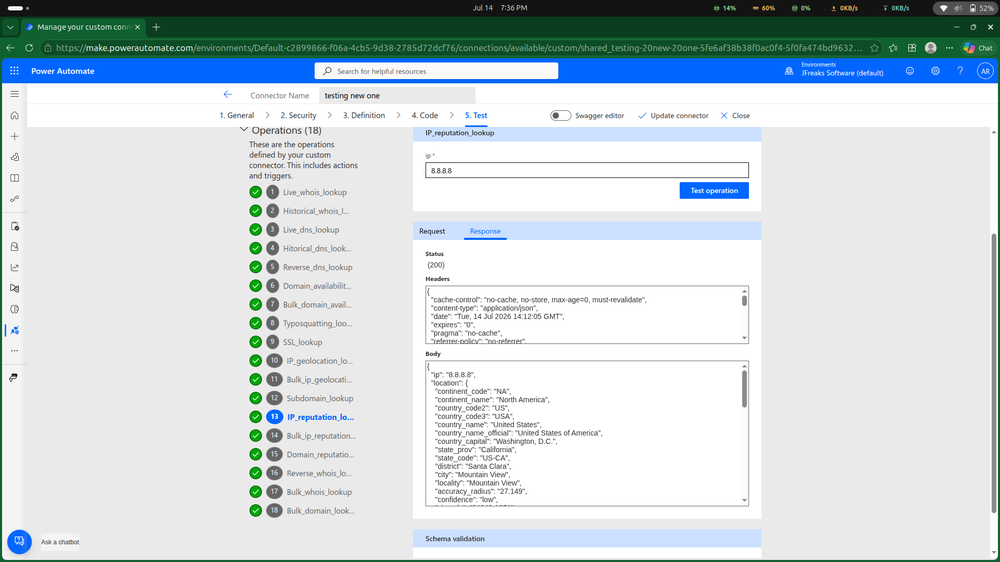
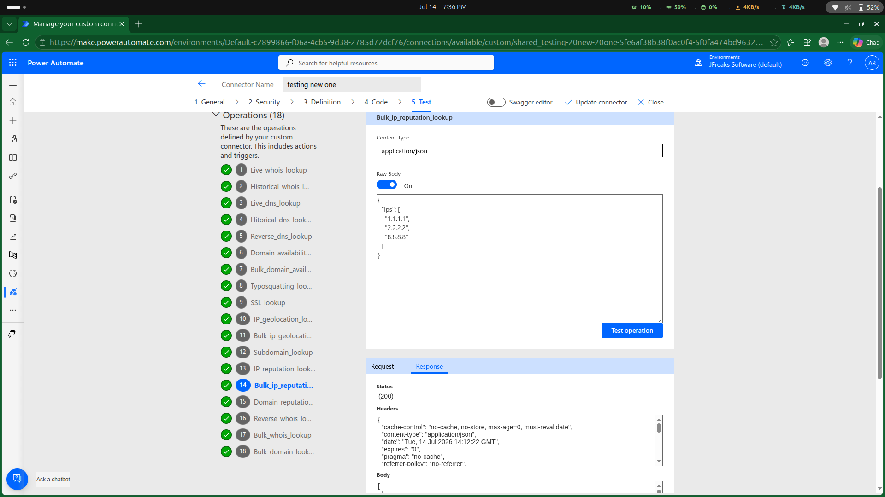
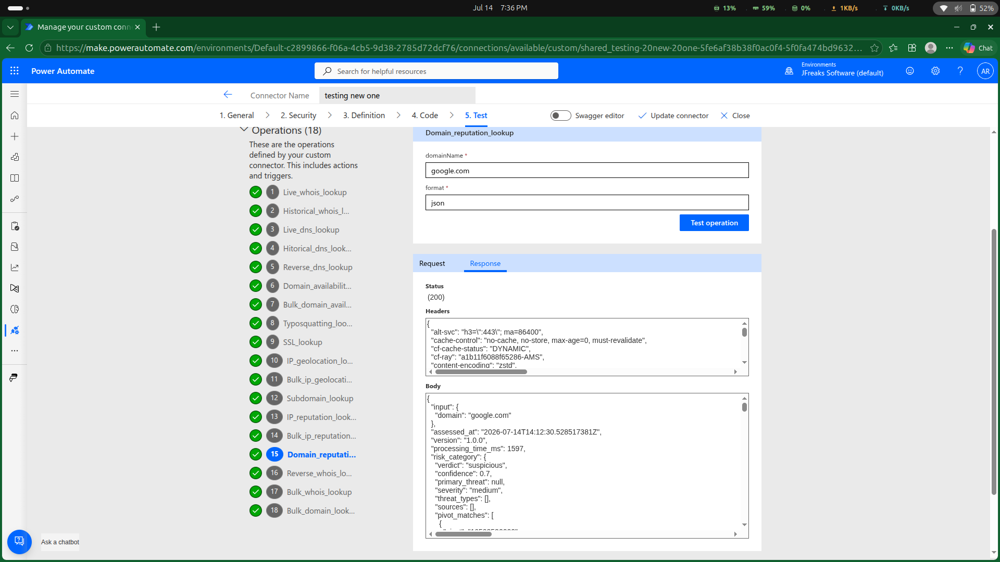
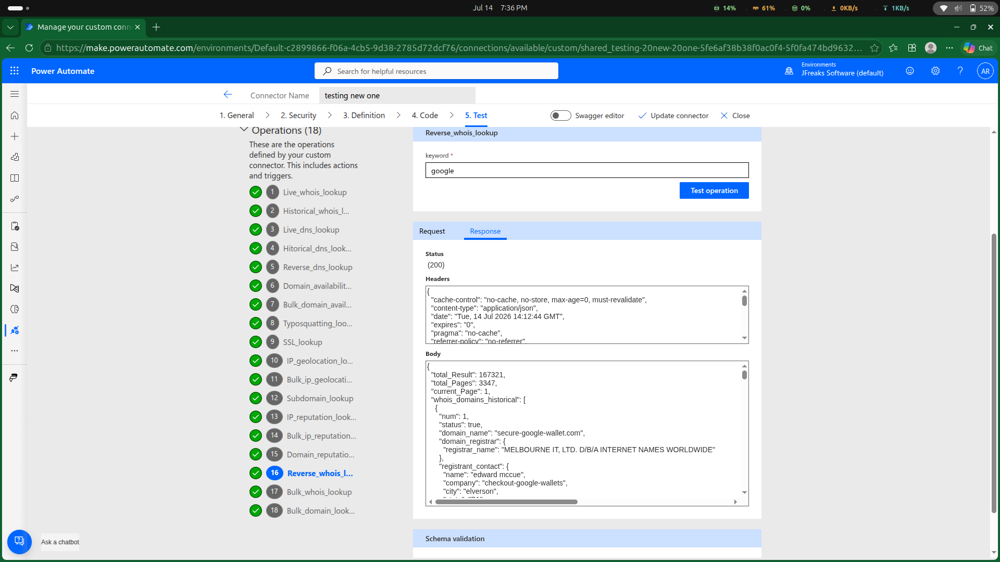

