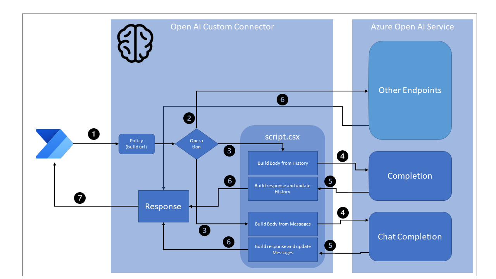

# Azure OpenAI Service

Azure OpenAI Service Connector for Power Platform & Azure Logic Apps.

> This is a connector based on the [OpenAI Independent Publisher connector](https://learn.microsoft.com/connectors/openaiip/) built by [Robin Rosegrün](https://linktr.ee/r2power). It has some extra actions, because that's how Azure OpenAI Service works.

## Publishers: Daniel Laskewitz, Andrew Coates & Robin Rosengrün

## Prerequisites

You will need the following to proceed:

* A Microsoft Power Apps or Power Automate plan with custom connector feature
* An Azure subscription and access to Azure OpenAI Service (currently in preview)
* The Power Platform Connectors CLI (Paconn CLI) tools ([link](https://learn.microsoft.com/connectors/custom-connectors/paconn-cli))

To install the connector, you can use the following command (from the same folder as the `apiDefinition.swagger.json` file):

```pwsh
paconn login
paconn create --api-def apiDefinition.swagger.json --api-prop apiProperties.json --script AzureOpenAIScript.csx --icon connector-icon.png
```

If you already have the connector installed, you can update it with the following command (from the same folder as the `apiDefinition.swagger.json` file):

```pwsh
paconn login
paconn update --api-def apiDefinition.swagger.json --api-prop apiProperties.json --script AzureOpenAIScript.csx --icon connector-icon.png
```

## Connection setup


After importing the connector, you should create a  connection. There are two properties you need to fill in when creating the connection:

* The API Key of the Azure OpenAI Service
* Endpoint name, this is the instance name of your Azure OpenAI Service. When the URL is `https://microsoft.openai.azure.com`, you should fill in `microsoft` here.

## Available actions


* `Create a completion` - With this action, you can provide a prompt which the Azure OpenAI Service will complete.
* `Get deployment` - With this action, you are able to get details about a deployment of a model inside of your instance of the Azure OpenAI Service.
* `Chat Completion (Preview)` - With this action, you can provide a prompt which the Azure OpenAI Chat Service will complete.
* `Create deployment` - With this action, you are able to create a deployment of a model inside of your instance of the Azure OpenAI Service.
* `Delete deployment` - With this action, you are able to delete a deployment of a model inside of your instance of the Azure OpenAI Service.
* `Embeddings` - With this action, you are able to create an embedding vector representing the input text.
* `List deployments` - With this action, you can list all deployments inside of your instance of the Azure OpenAI Service.
* `List models` - With this action, you can list all models that are available to your instance of the Azure OpenAI Service.
* `Request a generated image with DALL-E 3 (preview)` - With this action, you can generate an image with the DALL-E 3 model of your instance of the Azure OpenAI Service. DALL-E 3 is only available in the Sweden Central region.

## Connector Architecture



1. The connector is called from a Power Automate Flow, Power App or Logic App. The default policy is used to build the full Azure OpenAI endpoint from the `resource-name` (from the connection) and, if required, the `deployment-id` (passed as a header).
1. If the operation is neither `CreateCompletion` nor `ChatCompletion`, the operation is passed directly to the applicable endpoint in the Azure OpenAI REST service.
1. If the operation is either `CreateCompletion` or `ChatCompletion`, the operation is passed to `script.csx` where a new body is built from the parameters passed to the connector and the context property
1. The updated body is passed to the appropriate endpoint in the Azure OpenAI REST service.
1. The response is intercepted for `CreateCompletion` or `ChatCompletion` and a new response body crafted with the updated context property
1. The response is received by the custom connector and
1. The response is returned to the calling Power Automate Flow (or Power App, or Logic App)

### Maintaining State for Completions and Chat Completions

The `Create a completion` and `Create a chat completion (Preview)` actions both have a property that allows the previous interactions with the service to be passed back to the service on subsequent calls. This property is used to maintain state between calls to the API. The value of this property should be stored in a variable and passed back to the action on subsequent calls. The value of the property should be the value of the property of the same name from the previous call.

For the `Create a completion` action, the property is called `history`, and is an array of `question: answer` pairs. For the `Create a chat completion (Preview)` action, the property is called `messages` and is an array of `role: content` pairs.

This state is captured, manipulated and returned in the [custom code](./script.csx).

An example of using this state recursively in a Power Automate Flow is shown below:


Note that the `Chat Completion(Preview)` action is called twice in this example. The first time, the `history` property is not set, so the value of the property is `null`. The second time, the `history` property is set to the value of the `history` property returned by the previous call.

Note that the second prompt is simply "Where did they play their first gig?", but because the context of the original interaction is passed with the question, the model is able to disambiguate the request and answer in the expected manner.


## Resources

* [Azure OpenAI Service Documentation](https://learn.microsoft.com/azure/cognitive-services/openai/)
* [Azure OpenAI Service API Reference](https://learn.microsoft.com/azure/cognitive-services/openai/reference)
