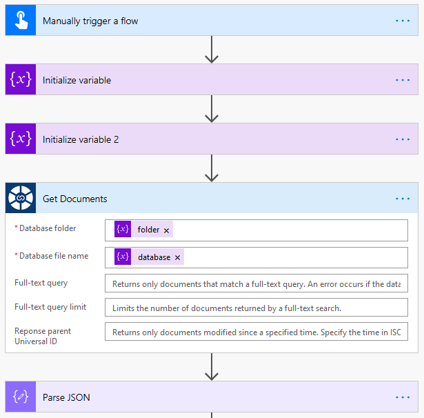
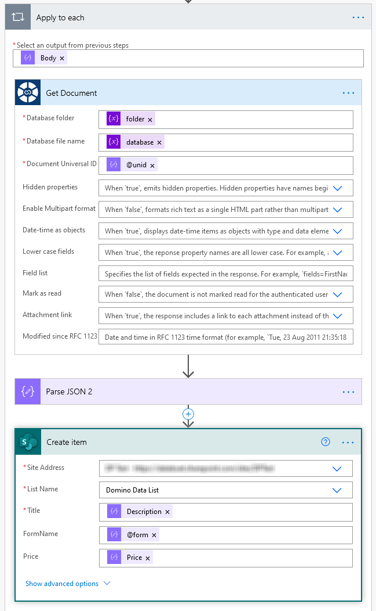

## NSF Data Connector

NSF Data Connector provides access to any IBM / HCL Domino database for which Domino Access Services (DAS) are enabled. The Connector represents databases, views, view entries, and documents in JSON format.

## Prerequisites

To proceed you will need the following:

- Domino Server v. 9.0.1 or higher with enabled Domino Access Services
  - To enable DAS on Domino the following [offical instructions](https://ds_infolib.hcltechsw.com/ldd/ddwiki.nsf/xpAPIViewer.xsp?lookupName=IBM+Domino+Access+Services+9.0.1#action=openDocument&res_title=Enabling_IBM_Domino_Access_Services_on_a_server_das901&content=apicontent) can be used
- Access to the Domino Server from the internet

## Deploying the Connector

Please use [these instructions](https://docs.microsoft.com/en-us/connectors/custom-connectors/paconn-cli) to deploy this connector as a custom connector in Microsoft Power Automate and Power Apps

## Supported Operations

The NSF Data Connector currently supports the following operations available from Domino Access Services:

- Domino Data Service - This is a REST API that accesses databases on Domino servers. The Domino Data Service receives requests and sends responses using HTTP and HTTPS protocols with body content in JSON format.

  - `GetDatabaseList`: Gets a list of databases
  - `GetViewList`: Gets a list of views and folders in a database
  - `GetViewDesignByName`: Gets information on the columns in a view or folder by view name
  - `GetViewDesignByUnid`: Gets information on the columns in a view or folder by view UNID
  - `GetViewEntriesByName`: Gets a list of view entries by view name
  - `UpdateFolderContentByName`: Updates the contents of a folder by folder name
  - `GetViewEntriesByUnid`: Gets a list of view entries by view UNID
  - `UpdateFolderContentByUnid`: Updates the contents of a folder by folder UNID
  - `GetDocuments`: Gets a list of documents
  - `CreateDocument`: Creates a new document
  - `GetDocument`: Reads a document
  - `DeleteDocument`: Deletes a document
  - `UpdateDocument`: Replaces all items in a document
  - `UpdateDocumentItems`: Updates selected items in a document
  - `GetAttachment`: Reads an attachment
  - `DeleteAttachment`: Deletes an attachment

Official documentation from HCL is available on the following [link](https://ds-infolib.hcltechsw.com/ldd/ddwiki.nsf/xpAPIViewer.xsp?lookupName=IBM+Domino+Access+Services+9.0.1#action=openDocument&res_title=IBM_Domino_Access_Services_overview_das901&content=apicontent)

## Sample Usage

### Flow

- **Example for Flow that copies the Domino documents into Sharepoint list**
- Get available documents and parse resulting Json

- Read all individual documents, parse them and insert into Sharepoint List using standard Sharepoint connector

## Further Support

- Please send your inquiry to [nsf.data@databoat.ch](mailto:nsf.data@databoat.ch)
