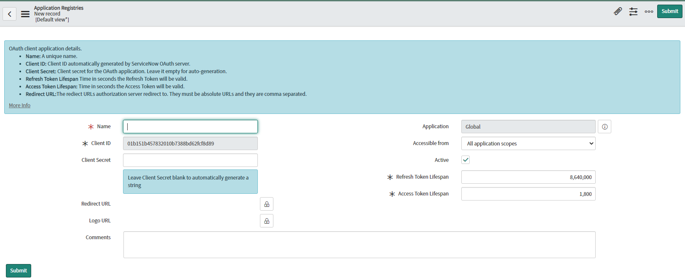
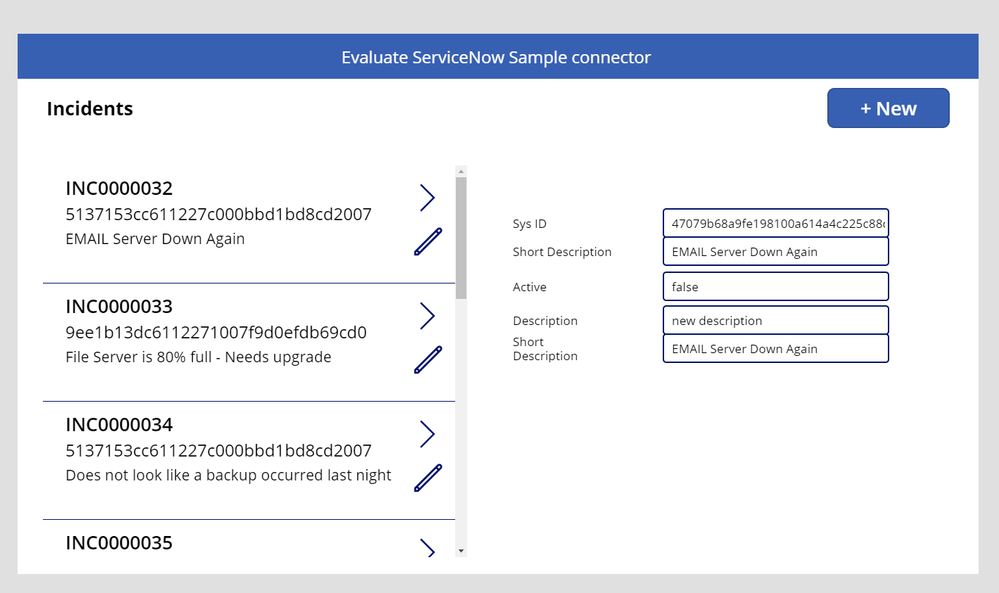
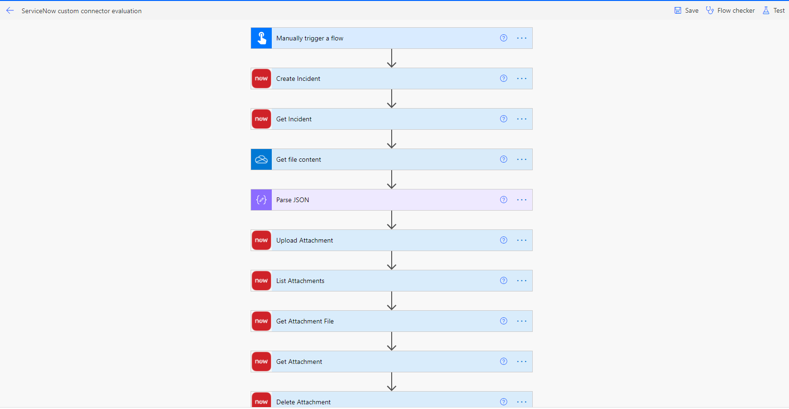

### NOTE
> This is a sample connector for ServiceNow that illustrates how to use basic CRUD operations along with added OAuth authentication and attachments support. ServiceNow improves service levels, energizes employees, and enables your enterprise to work at light speed

## ServiceNow [Sample] Connector
This is a sample connector provided here with the intent to illustrate basic create, read, update & delete operations on ServiceNow Incident records, handle attachments with OAuth authentication support

- Public connector: https://docs.microsoft.com/en-us/connectors/service-now/
- Website	https://www.servicenow.com/
- Privacy policy	https://www.servicenow.com/privacy-statement.html

## Prerequisites
You will need the following to proceed:
* A ServiceNow subscription and a ServiceNow instance. Get started here: https://www.servicenow.com/

## Building the connector
We need to create an OAuth application endpoint for external clients to access and update the details in respective files. 


### Set up an endpoint in ServiceNow for clients to access the instance
We need to create an OAuth application endpoint in the ServiceNow instance. This will allow for external client applications to access our ServiceNow instance. 

#### NOTE
> Role required: admin

You can read more about this [here](https://docs.servicenow.com/bundle/paris-platform-administration/page/administer/security/task/t_CreateEndpointforExternalClients.html) and follow the steps below:

1. In your ServiceNow instance, Navigate to System OAuth > Application Registry and then click New.
2. On the interceptor page, click Create an OAuth API endpoint for external clients and then fill the form with the following details:
    - For Name, use a unique name that identifies the application that you require OAuth access for. 
    - For Redirect URL, use “https://global.consent.azure-apim.net/redirect”
    - For Active, select the check box to make the application registry active.
    - Leave the Refresh Token Lifespan and Access Token Lifespan as is, unless you see a need to modify them. 
    - Client ID is automatically generated. Save this `Client ID` to be used in apiProperties.json file in later steps. 
    - `Client Secret` is generated once you click submit. Save this information to use in later steps while deploying the connector. This is the shared secret string that both the instance and the client application or website use to authorize communications with one another.
3. Click Submit to create the OAuth endpoint 



At this point we have a valid OAuth application endpoint for external client applications to access your ServiceNow instance. The next step is to update the instance details and Client ID in the json files. 

### Update ServiceNow instance details and Client ID
#### Update instance details
1. Go to your ServiceNow instance, copy the `instance` details and update in the next step. 
2. Replace `YourInstance` in 
    - apiProperties.json file - under authorizationURL, tokenURL and refreshURL
    - apiDefinitions.swagger.json file - for host, authorizationURL and tokenURL.  

#### Update Client ID
Replace `Client ID` in apiProperties.json file by using the Client ID value noted before when creating the endpoint in ServiceNow. 

### Deploying the sample
Run the following commands and follow the prompts:

```paconn
paconn create --api-def apiDefinition.swagger.json --api-prop apiProperties.json --secret <client_secret>
```

## Sample Canvas app
You can download a sample canvas app "ServiceNowCustomConnectorDemoApp.msapp" [here](https://blogdocuments.blob.core.windows.net/blogdocscontainer/ServiceNowCustomConnectorDemoApp.msapp) that illustrates how you may use the connector from a canvas app.

To build the app, you will need to:
* Deploy the custom connector from GitHub to an environment using steps from above
* Create a new app using the sample .msapp file.
* Edit the app and add a connection to the custom connector from your app. 

The app provides example use of the basic functionality provided by the sample connector

#### Sample expressions:

- List incidents:

        gal_ListIncidents_1.Items = 'ServiceNow[Sample]'.ListIncidents(true,{sysparm_limit:10}).result

- Create incident

        Set(CreatedIncident, 'ServiceNow[Sample]'.CreateIncident(true, {sysparm_display_value:false, location:"sample location", short_description:"short description"}).result))

- Upload attachment

        Set(UploadedAttachment, 'ServiceNow[Sample]'.UploadAttachment("incident",[table_sys_id],"Sample File","image/png", UploadedImage2_1.Image).result)



## Sample Power Automate flow
You can download a sample Power Automate flow "ServiceNowCustomConnectorSampleFlow.zip" [here](https://blogdocuments.blob.core.windows.net/blogdocscontainer/ServiceNowCustomConnectorSampleFlow.zip) that illustrates how you may use the connector from a flow.

To build the flow, you will need to:
* Deploy the custom connector from GitHub to an environment using steps from above
* Create a new flow in flow.microsoft.com, by importing the sample .zip file provided 
* Edit the flow and add a connection to the custom connector and OneDrive for business(for attachment upload scenarios). 

The sample flow provides example use of basic functionality in the custom connector using Power Automate flow



## Supported Operations
The connector supports the following operations:
* `List Incidents`: Retrieves a list of incidents
* `Get Incident`: Retrieves the specified incident record using the provided Id parameter
* `Create Incident`: Creates a new incident
* `Update Incident`: Updates a specified incident record
* `Delete Incident`: Deletes a specified incident record
* `Upload Attachment`: Uploads a specified binary file as an attachment to the specified record.
* `List Attachments`: Returns the metadata for multiple attachments
* `Get Attachment`: Returns the metadata of the attachment
* `Get Attachment File`: Returns the binary file attachment for the specified record
