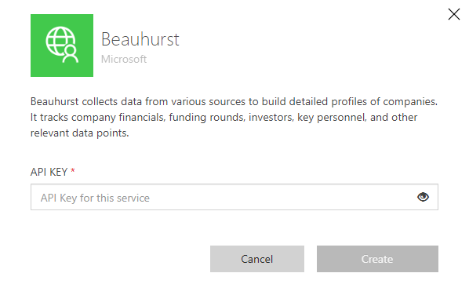

# Beauhurst
Beauhurst is a UK-based platform that provides data, insights, and analysis on high-growth and innovative companies. It focuses on tracking startups, scale-ups, and high-growth companies across various sectors, including technology, finance, healthcare, and more. Beauhurst offers a comprehensive database that investors, entrepreneurs, and other stakeholders can use to gather information about companies' funding rounds, financial performance, leadership changes, and other relevant details.

## Publisher: Axazure

https://www.axazure.com/en/

## StackOwner: Beauhurst
https://www.beauhurst.com/about/

## Pre-requisites
To use this connector is necessary to have an account in Beauhurst and get the API key in you personal area.

## Create your connection

Once you have an account with Beauhurst, go to https://platform.beauhurst.com/user/subscription/ and get your API key 

Then go to the connector and create the connexion.

## Connector methods

- ### <strong> Get Company FID </strong>
    Get the FID from Beauhurst using company name
- ### <strong> Get Company Information by FID </strong>
    Get all the company info using the FID
- ### <strong> Get funds received by company.</strong>
    Get funds received by FID and select the type of funds (grants or fundraisings)

