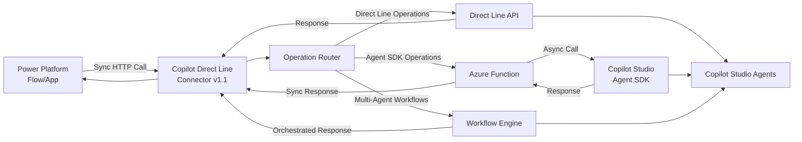

# Copilot Direct Line (Independent Publisher)
Direct Line allows for connecting directly to a Copilot Studio agent with enhanced hybrid capabilities including multi-agent workflows, synchronous operations, and Azure Function integration.

## Publisher: Troy Taylor, Hitachi Solutions

## Version 1.1 - What's New
- **Multi-Agent Workflows** - Orchestrate multiple agents in sequential or parallel patterns
- **Enhanced Synchronous Operations** - Start conversations and wait for responses in a single call
- **Azure Function Integration** - Route Agent SDK calls through Azure Functions via policy templates
- **Dual Authentication** - Support both Direct Line API keys and OAuth2 for Agent SDK
- **Enhanced Response Metadata** - Detailed operation tracking and response source information
- **Backward Compatibility** - All original Direct Line operations preserved

## Architecture Overview



### Flow Description
1. **Power Platform** makes synchronous HTTP calls to the connector
2. **Connector Router** determines operation type and routes accordingly:
   - **Direct Line Operations**: Route directly to Bot Framework Direct Line API
   - **Agent SDK Operations**: Route through Azure Function middleware 
   - **Multi-Agent Workflows**: Process through internal workflow engine
3. **Azure Function** bridges synchronous requests with asynchronous Agent SDK calls
4. **Workflow Engine** orchestrates multiple agents in sequential or parallel patterns
5. **Responses** return synchronously to Power Platform for deterministic automation

## Prerequisites
- Your Copilot Studio (or Bot Framework) agent must have web channel security enabled
- For hybrid Agent SDK operations: Azure Function with Agent SDK proxy (optional)
- OAuth2 application registration for Agent SDK authentication (optional)

## Authentication Options

### Direct Line API Key (Required)
1. In the Security settings of your agent, copy a secret from the two available
2. Use this for all Direct Line operations and multi-agent workflows

### OAuth2 Token (Optional - for Agent SDK)
1. Register an application in Azure AD
2. Configure OAuth2 with scope: `CopilotStudio.Copilots.Invoke`
3. Update connector's `apiProperties.json` with your client ID

## Supported Operations

### New Hybrid Operations (v1.1)

#### Start Conversation with Activity
Starts a new conversation, sends the first activity, and waits for the agent to respond synchronously.
- **Input**: `{ "text": "Hello", "from": "user" }`
- **Output**: Complete activity set with conversation metadata

#### Send Activity and Wait for Response  
Sends activity to an existing conversation and waits for the agent to respond.
- **Path**: `/conversations/{conversationId}/activitiesResponse`
- **Output**: Activity set with bot response and enhanced metadata

#### Execute Multi-Agent Workflow
Orchestrates multiple agents in sequential or parallel workflows.
- **Input**: 
  ```json
  {
    "agents": [
      {"agentId": "agent1", "directLineSecret": "secret1"},
      {"agentId": "agent2", "directLineSecret": "secret2"}
    ],
    "userMessage": "Process this request",
    "workflowType": "sequential" // or "parallel"
  }
  ```
- **Output**: Aggregated results from all agents with workflow metadata

#### Call Agent Sync (Azure Function Routing)
Routes Agent SDK calls through Azure Function middleware (configured via policy template).

### Original Direct Line Operations (Preserved)

#### Start a conversation with activity
Starts a new conversation, sends the first activity and waits for the agent to respond.

#### Post activity and receive response
Sends activity to this conversation and waits for the agent to respond.

#### Start conversation
Starts a new conversation.

#### Get conversation
Retrieve information about an existing conversation.

#### Get activities
Retrieve activities in this conversation. This method is paged with the 'watermark' parameter.

#### Post activity
Sends activity to this conversation.

#### Upload file
Uploads file and sends as attachment.

## Usage Examples

### Simple Synchronous Conversation
```json
POST /StartConversationWithActivity
{
  "text": "What's the weather like today?",
  "from": "user"
}
```

### Multi-Agent Sequential Workflow
```json
POST /ExecuteMultiAgentWorkflow
{
  "agents": [
    {"agentId": "data-agent", "directLineSecret": "secret1"},
    {"agentId": "analysis-agent", "directLineSecret": "secret2"},
    {"agentId": "summary-agent", "directLineSecret": "secret3"}
  ],
  "userMessage": "Analyze Q3 sales data",
  "workflowType": "sequential"
}
```

### Multi-Agent Parallel Workflow
```json
POST /ExecuteMultiAgentWorkflow
{
  "agents": [
    {"agentId": "weather-agent", "directLineSecret": "secret1"},
    {"agentId": "news-agent", "directLineSecret": "secret2"},
    {"agentId": "calendar-agent", "directLineSecret": "secret3"}
  ],
  "userMessage": "Get my daily briefing",
  "workflowType": "parallel"
}
```

## Configuration

### Policy Template for Azure Function Routing
The connector includes a policy template to route Agent SDK calls to Azure Functions:

```json
{
  "templateId": "routerequesttoendpoint",
  "title": "Route Agent SDK calls to Azure Function",
  "parameters": {
    "x-ms-apimTemplateParameter.newPath": "/api/agent-proxy",
    "x-ms-apimTemplateParameter.httpMethod": "@Request.OriginalHTTPMethod",
    "x-ms-apimTemplateParameter.routeToOperation": "CallAgentSync"
  }
}
```

## Response Metadata

All hybrid operations include enhanced metadata:

```json
{
  "activities": [...],
  "token": "...",
  "conversationId": "...",
  "lastActivity": {...},
  "metadata": {
    "operationType": "StartConversationWithActivity",
    "responseSource": "DirectLine",
    "connectorType": "hybrid", 
    "version": "1.1"
  }
}
```

## Known Issues and Limitations
- Multi-agent workflows require separate Direct Line secrets for each agent
- Azure Function routing requires proper policy template configuration
- OAuth2 authentication requires Azure AD application registration
- Workflow execution time is limited by Power Platform connector timeout (2 minutes)

## Migration from v1.0
Version 1.1 is fully backward compatible. All existing v1.0 operations continue to work unchanged while new hybrid capabilities are available as additional operations.
