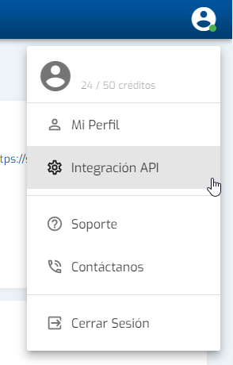
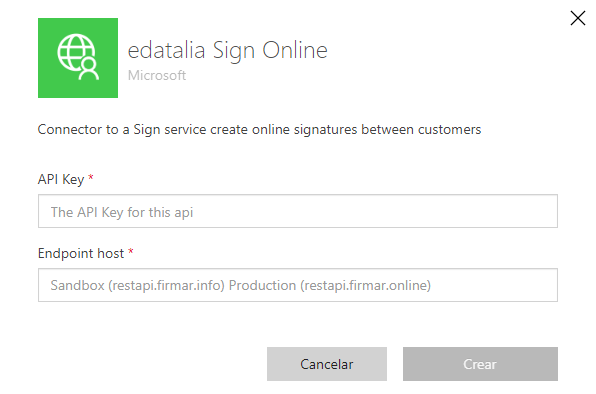

# Edatalia sign Online
Edatalia sign Online is a connector to provide access to their sign platform using Power Platform services. This connector give you the posibility of send document to sign with diferent method like OTP, Acceptance Signature, Bio Signature, etc

## Publisher: Axazure

https://www.axazure.com/en/

## StackOwner: Edatalia
https://firmar.online/

## Pre-requisites
To use this connector is necessary to have an account in firmar.online with credits and a premium license in Power Platform.
For sandbox instances to test the host should be: https://restapi.firmar.info
For production instances: https://restapi.firmar.online

You can create a test instance in https://firmar.online/

## Create your connection

Once you have an account with firmar.online, go to the integration panel and get your API key

Then go to the connector and create the connexion.

## Connector methods

- ### <strong> Send simple document to sign.</strong>
    Send a document to be signed for one or more recipients.
- ### <strong> Send document to sign.</strong>
    Send multiple documents to be signed by one or more recipients.
- ### <strong> Get envelop details.</strong>
    Get all the information regarding with the envelop including the number of documents.
- ### <strong> Get evidence signed document.</strong>
    Get the document in base 64 with all the evidences of the document.
- ### <strong> Get signed document.</strong>
    Get the signed document in base 64.

