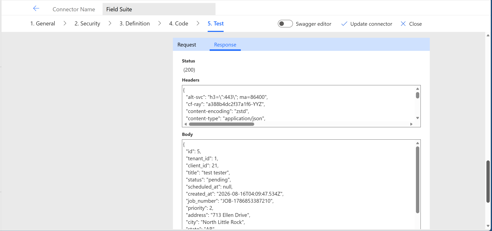
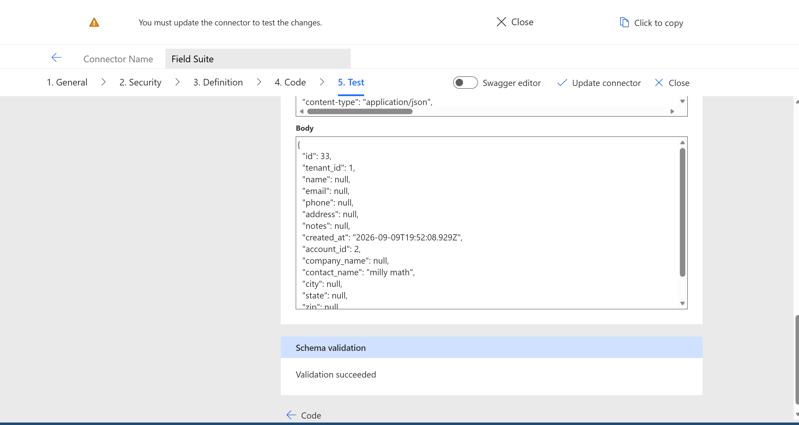
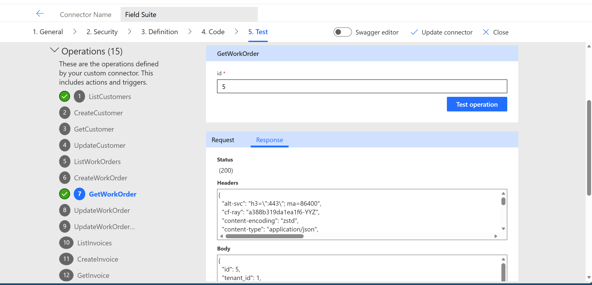

# Field Suite Cloud — Testing Evidence

The following screenshots show successful Power Automate test results against a live Field Suite Cloud tenant.

## Test 1 — List Customers

## Test 2 — List Work Orders

## Test 3 — List Invoices

## Summary

All core actions were tested in the Power Automate custom connector test pane against `https://pantherhive-api.hotwodi4.workers.dev` using a valid bearer JWT. Actions returned HTTP 200 with correctly typed response bodies.
