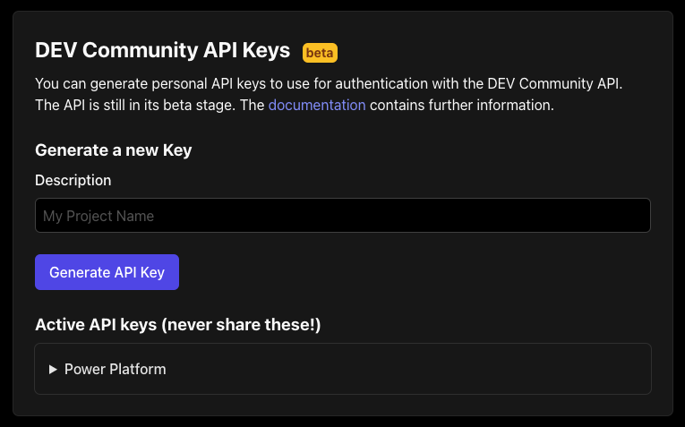

## Forem Connector

Forem is an open source platform for building modern, independent, and safe communities.

## Publisher: Daniel Laskewitz

## Prerequisites

* Get an API key from your Forem instance.

## Supported Operations

The connector supports the following operations:
* `Get my articles`: Gets your articles
* `Get my published articles`: Gets your published articles
* `Get my unpublished articles`: Gets your unpublished articles
* `Get all my articles`: Gets all your published articles
* `Get articles`: Gets a list of articles
* `Get user`: Gets a user and its details
* `Retrieve podcast episodes`: Gets a list of podcast episodes
* `Get profile image`: Gets a user profile image
* `Get readinglist`: Gets a the readinglist of a user

## Obtaining Credentials

To use this connector, you will need to obtain an API key. This API key can be generated by the user via their settings page in Forem.

> For example for DEV.to (a Forem instance) you can generate it at the bottom of the [settings page](https://dev.to/settings):

## Known issues and limitations

There are no known issues and limitations.
