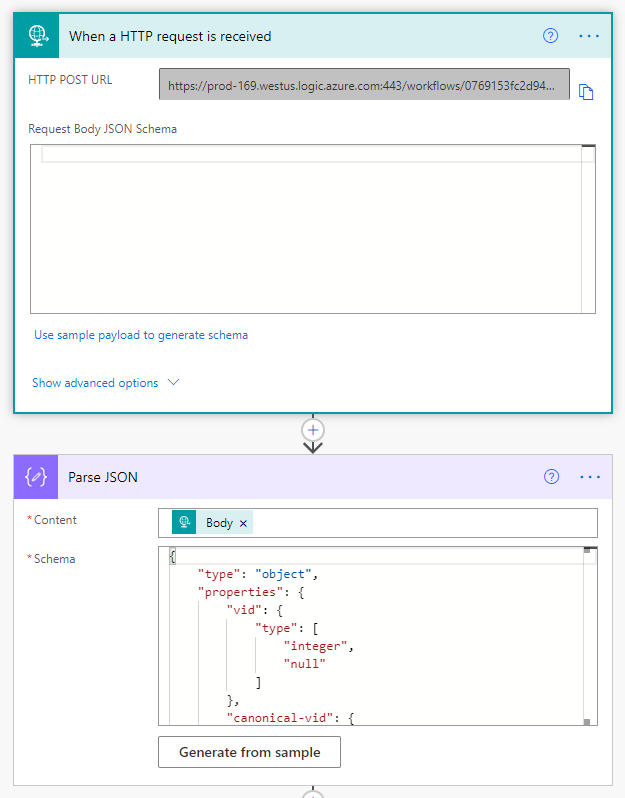
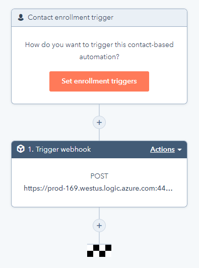

# HubSpot CRM
HubSpot’s CRM platform has all the tools and integrations you need for marketing, sales, content management, and customer service. Powerful sales CRM software to help teams close more deals, deepen relationships, and manage their pipeline more effectively — all on one easy-to-use platform.

## Publisher: Hitachi Solutions

## Prerequisites
A paid or trial HubSpot account.

## Getting Started
You will need to gather either an API key or OAuth credentials to use with this connector.

### Getting Started with HubSpot Workflows and Power Automate

In order to use HubSpot Workflows as a trigger with Power Automate, you will need to first configure a instant cloud flow using the 'When a HTTP request is received' [trigger](https://docs.microsoft.com/en-us/learn/modules/http-connectors/4-http-request). After saving the flow, the trigger will populate with a HTTP Post URL you will use later with your HubSpot Workflow.

It is highly recommended that a separate flow be created for each HubSpot object workflow in order to minimize JSON parse errors, e.g. workflows for new contacts and contact updates, with best practice being separate flows for each object action. An example using the default HubSpot fields for contacts can be [found here](Contact%20JSON.json). Keep in mind that if your HubSpot object have any custom fields or you later add custom fields, you will need to generate the schema again using the new JSON payload.

[HubSpot Workflows](https://knowledge.hubspot.com/workflows/create-workflows) can be found on the menu bar in your HubSpot account. You can create workflows for any object that your account has access to:

  - Contacts
  - Companies
  - Deals
  - Conversations
  - Quotes (with Sales Hub Enterprise)
  - Tickets (with Service Hub Professional or Enterprise)
  - Custom objects (Enterprise only)

Similar to Power Automate, Workflows are built using a trigger and subsequent actions.

A trigger can only select one HubSpot object to monitor, but within that object, multiple filters can selected using any of the object fields with And and Or rules. Once your trigger is configured, you will need to add a 'Trigger Webhook' action. In the Webhook URL textbox, add the URL the flow trigger generated and click Save. You will now need to review the workflow configuration and turn the workflow on to start triggers to Power Automate.

The HTTP call from HubSpot is queued, so expect a delay of 10 seconds or more before the Power Automate trigger starts.

## Obtaining Credentials
A HubSpot account (trial or paid) is needed for API key access. The API key is specific to a HubSpot account, not each user, and only one key is allowed at a time. The key can be found in Account Settings > Account Setup > Integrations > API Keys. More information can be found [here](https://knowledge.hubspot.com/articles/kcs_article/integrations/how-do-i-get-my-hubspot-api-key).

A free HubSpot developer account is needed to install an OAuth app in your account for OAuth 2.0 access. Installed apps can be found in Account Settings > Account Setup > Integrations > Connected Apps. More information can be found [here](https://developers.hubspot.com/docs/api/working-with-oauth).

## Supported Operations

### Companies

#### List companies
Return a list of companies.
#### Create a company
Create a company with the given properties and return a copy of the object, including the ID.
#### Get a company
Read a company identified by {companyId}.
#### Update a company
Perform a partial update of a company identified by {companyId}. Provided property values will be overwritten. Read-only and non-existent properties will be ignored. Properties values can be cleared by passing an empty string.
#### Delete a company
Move a company identified by {companyId} to the recycling bin.

### Contacts

#### List contacts
Read a list of contacts.
#### Create a contact
Create a contact with the given properties and return a copy of the object, including the ID.
#### Get a contact
Read a contact identified by {contactId}.
#### Update a contact
Perform a partial update of a contact identified by {contactId}. Provided property values will be overwritten. Read-only and non-existent properties will be ignored. Properties values can be cleared by passing an empty string.
#### Delete a contact
Move a contact identified by {contactId} to the recycling bin.

### Deals

#### List deals
Return a list of deals.
#### Create a deal
Create a deal with the given properties and return a copy of the object, including the ID.
#### Get a deal
Read a deal identified by {dealId}.
#### Update a deal
Perform a partial update of a deal identified by {dealId}. Provided property values will be overwritten. Read-only and non-existent properties will be ignored. Properties values can be cleared by passing an empty string.
#### Delete a deal
Move a deal identified by {dealId} to the recycling bin.

### Products

#### List products
Return a list of products.
#### Create a product
Create a product with the given properties and return a copy of the object, including the ID.
#### Get a product
Read a product identified by {productId}.
#### Update a product
Perform a partial update of a product identified by {productId}. Provided property values will be overwritten. Read-only and non-existent properties will be ignored. Properties values can be cleared by passing an empty string.
#### Delete a product
Move a product identified by {productId} to the recycling bin.

### Line Items

#### List line items
Return a list of line items. Control what is returned via the properties query param.
#### Create a line item
Create a line item with the given properties and return a copy of the object, including the ID.
#### Get a line item
Read a line item identified by {lineItemId}. {lineItemId} refers to the internal object ID by default, or optionally any unique property value as specified by the idProperty query param. Control what is returned via the properties query param.
#### Update a line item
Perform a partial update of a line item identified by {lineItemId}. {lineItemId} refers to the internal object ID by default, or optionally any unique property value as specified by the idProperty query param. Provided property values will be overwritten. Read-only and non-existent properties will be ignored. Properties values can be cleared by passing an empty string.
#### Delete a line item
Move an Object identified by {lineItemId} to the recycling bin.

### Tickets

#### List tickets
Read a list of tickets. Control what is returned via the properties query param.
#### Create a ticket
Create a ticket with the given properties and return a copy of the object, including the ID. Documentation and examples for creating standard tickets is provided.
#### Get a ticket
Read a ticket identified by {ticketId}. {ticketId} refers to the internal object ID by default, or optionally any unique property value as specified by the idProperty query param. Control what is returned via the properties query param.
#### Update a ticket
Perform a partial update of a ticket identified by {ticketId}. {ticketId} refers to the internal object ID by default, or optionally any unique property value as specified by the idProperty query param. Provided property values will be overwritten. Read-only and non-existent properties will be ignored. Properties values can be cleared by passing an empty string.
#### Archive a ticket
Move a ticket identified by {ticketId} to the recycling bin.

## Known Issues and Limitations
No issues and limitations are known at this time.

## Frequently Asked Questions
### How do I obtain API key?
If you are not the HubSpot administrator for your account, check with the administrator before generating a new API key. If you have a HubSpot developer account connected to your company account, multiple OAuth apps can be installed in each company account.
