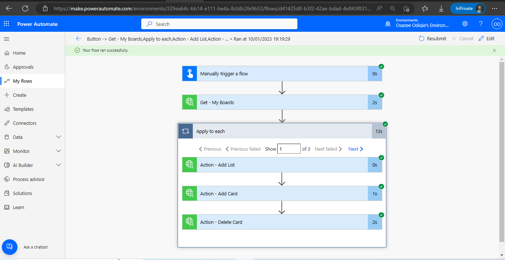
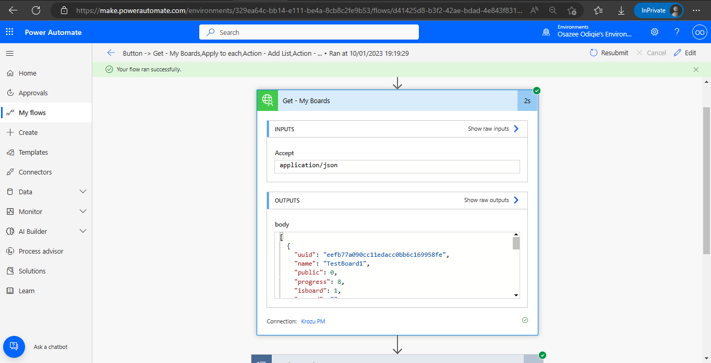
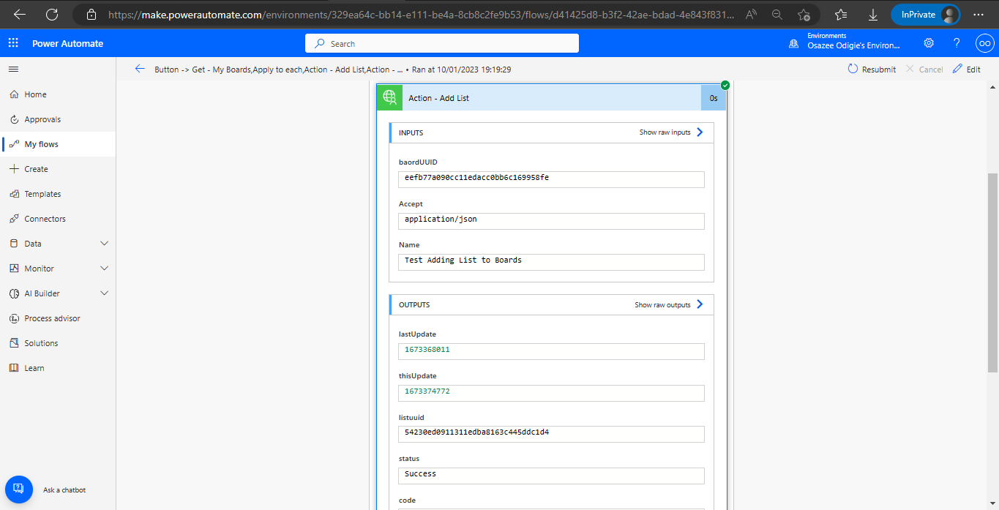
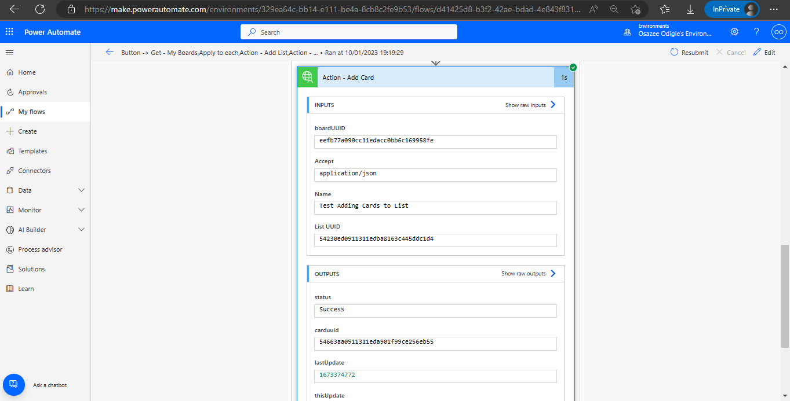
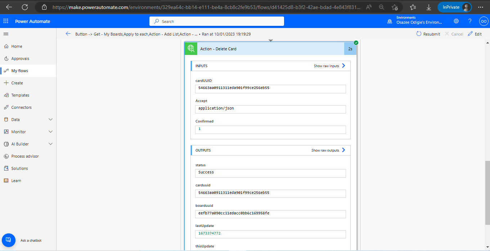

# Krozu
Krozu is the worlds only hierarchical recursive project management tool that effectively works as a proper business management tool and a system of record. This connector enables users to track and receive notifications on project boards, lists, and cards. Users will be able to integrate with Dynamics 365 and other Power Platform prducts, as well as leverage the tree feature in krozu.

## Publisher: Osazee Odigie

## Prerequisites
To authenticate (using Oauth 2.0), users you must acquire a **Client ID** and **Client Secret** from within their Krozu account. Hence, they need to do the following:
- Create a free account on [www.krozu.com](www.krozu.com)
- Log in and click on **My Account** on the left sidebar.
- Click on **Integrations**
- Enter the **Client Name** (use a name that best suits the integration)
- Enter [https://global.consent.azure-apim.net/redirect](https://global.consent.azure-apim.net/redirect) for the **Redirect URL** field.
- Click **Submit** and note down the **Client ID** and **Client Secret**.

## Supported Operations
### Get - My User Profile
Returns the current users profile information.

### Get - My Boards
Returns all accessible boards for the current user.

### Get - My Owned Trees
Returns the root boards, or Project Tree root boards owned by the current user.

### Get - My Assigned Boards
Returns all boards the current user is assigned to or has Team Member access to.

### Get - Board Groups
Returns all groups and their settings applicable to this specified board.

### Get - My Notifications
Returns all active notifications for the current user.

### Get - My Tasks All
Returns the current users tasks.

### Get - My Tasks New
Returns the current users tasks that are new withing the last 30 days.

### Get - My Tasks Overdue
Returns the current users overdue tasks.

### Get - Board Lists
Returns all lists and their settings applicable to the specified board.

### Get - Board Lists
Returns all cards and their settings applicable to the specified board.

### Get - List Cards
Returns all cards and their settings applicable to the specified list.

### Get - List
Returns the specified list settings.

### Get - Card
Returns the specified card settings.

### Get - Board Messages
Returns all chat messages from the specified board.

### Get - Board Members
Returns all members and their permission levels associated with the specified board.

### Get - Board Records
Returns all records of activity that have happened on the specified board.

### Get - Board Records
Returns all records of activity that have happened on the specified board.

### Action - Add Card
Adds a card to the specified board within the specified list.

### Action - Delete Card
Deletes the specified card/board and its child objects as long asconfirmed is 1. Please ensure that that all affected child objects are good to be deleted as well.

### Action - Add Message to Board
Adds a message to the specified boards Messaging tray.

### Add Checklist to Card
Adds an empty checklist to the card specified.

### Action - Add List
Adds a list to the board specified with the name specified.

### Action - List Rename
Renames the specified list to the name specified.

### Action - Board Rename
Renames the board specified to the name specified.

### Action - Assign to Card
Assign a new or existing user to this Card or Board with a specified Role.

### Action - Assign to Board
Assign a new or existing user to this Board with a specified Role.

### Action - Unassign from Card
Unassign existing user from this Card or Board with a specified Role.

### Action - Unassign from Board
Unassign existing user from this Card with a specified Role.

### Action - Delete List
Deletes the specified list as long as confirmed is 1 and the list is empty.

### Test Operations within Krozu PM Connector
  

  

### Krozu PM Connector Test within a Power Automate Flow

### Overall Test Result
 
  

### Get - My Boards
 
  

### Action - Add List
 
  

### Action - Add Card
 
  

### Action - Delete Card
 

## Known Issues and Limitations
No identified issue yet.  
However, there is a set API usage limit clearly defined in the [terms of use](https://krozu.com/terms). You would need to contact Krozu via email: **support@krozu.com** if needs differs from the limitation.

## API Documentation
API: [https://developers.aftership.com/reference/](https://developers.aftership.com/reference/)
 
Terms of Use: [https://krozu.com/terms](https://krozu.com/terms)
