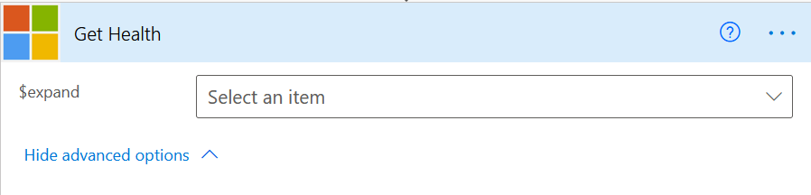
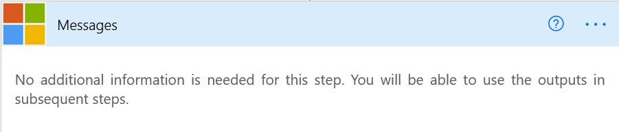
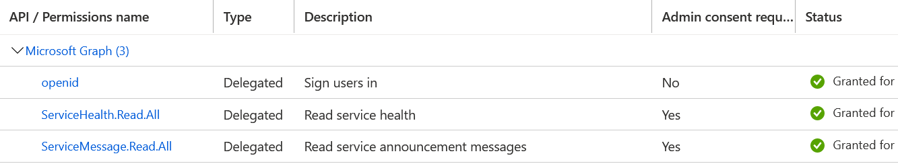
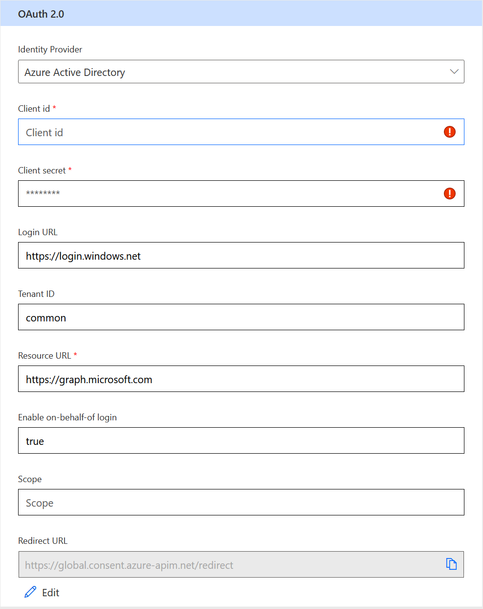

# Microsoft 365 Service Health & Messages
This connector connects to the Microsoft Graph (BETA) to get Service Health and Messages for the Microsoft 365 Platform.

## Publisher: Nick Brown

## Prerequisites: 
Create an App Registration in AAD for this connector to use with permission to the graph (see below)

## Supported Operations
There are two actions in this connector, Get Messages and Get Health.  Get Health has optional flag to expand the issues and show individual issues for that service

## Getting Started
1. In Azure Active Directory create an App Registration
1. Give it a Name (e.g. Graph Health Connector)
1. Enter the Redirect URI of `https://global.consent.azure-apim.net/redirect`
1. Add the API permissions:
    
    1. Delegate > ServiceHealth.Read.All
    1. Delegate > ServiceMessage.Read.All
1. Grant admin consent for your tenant
1. Generate an app secret
1. Enter the Client ID and Client Secret into the connector secrurity
    

## Known Issues and Limitations
Using the BETA Graph so urls/responses could change