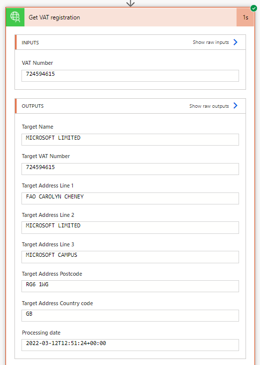

# U.K. Government Check VAT
GOV.UK's Check VAT API provides validation of registered VAT numbers and information about used name and address of the given business. With the growing need for verified and quality customer data, businesses and consumers can count on GOV.UK Check VAT API.

## Publisher: Fördős András

## Prerequisites
There are no prerequisites needed for this connector.

## Obtaining Credentials
This connector does not use authentication, so no credentials are needed.

## Supported Operations
### Get VAT registration
Allows the retrieval of name and address of a VAT regstered company.
### Get VAT registration with reference
Allows the retrieval of name and address of a VAT registered company while providing proof that you have performed the check.

## Known Issues and Limitations
There are no known issues at this time.

Be aware that the source API is currently in BETA version, so breaking changes can be expected.

## Example

