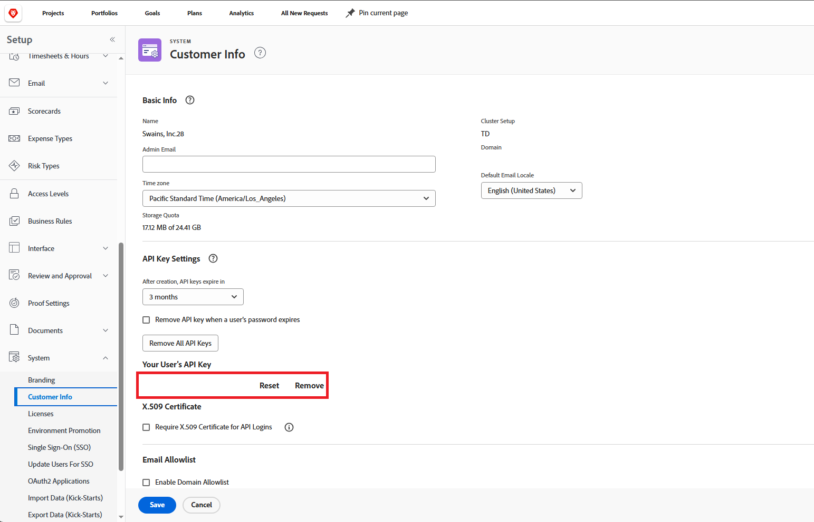
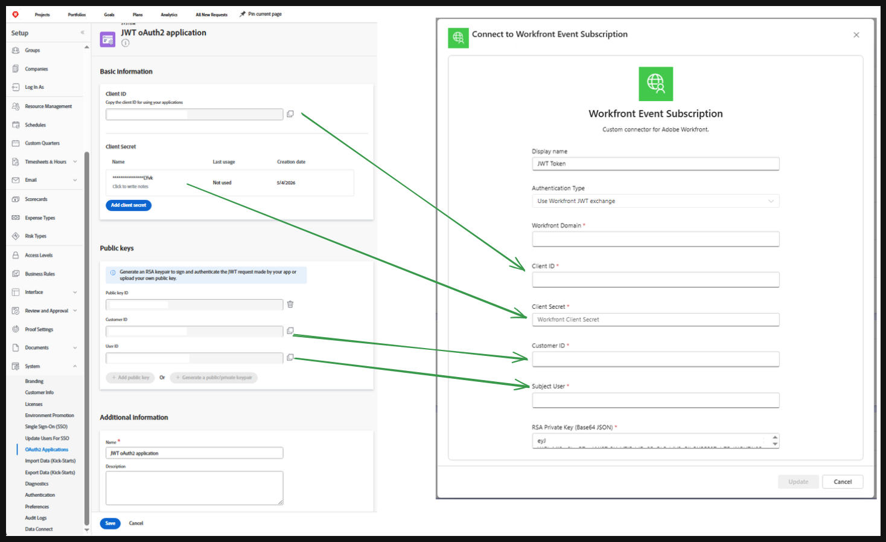

# Adobe Workfront Event Subscriber Connector

This repository contains a Power Automate custom connector for Adobe Workfront event subscription API.

The connector exposes a trigger for Workfront event subscriptions and handles Workfront authentication inside the custom connector policy script. It supports two authentication modes:

- API key to `sessionID` exchange
- JWT exchange to OAuth access token

The trigger creates a Workfront event subscription and receives webhook payloads from Workfront when supported objects are created, updated, or deleted.

## Connector idea

The connector is designed to bridge Adobe Workfront event subscriptions into Power Automate.

At a high level it works like this:

1. A flow uses the custom trigger `When a Workfront event occurs`.
2. The trigger creates a Workfront event subscription against `/attask/eventsubscription/api/v1/subscriptions`.
3. Power Automate provides the callback URL that Workfront should call.
4. Workfront sends event payloads to the flow when matching events happen.
5. The policy script in [script.csx](./script.csx) converts connector credentials into the authentication artifacts expected by Workfront.

Supported authentication modes:

- `api-auth`: uses a Workfront API key and exchanges it for `sessionID`
- `jwt-exchange`: signs a JWT with an RSA private key, exchanges it for an access token, and sends that token to Workfront as `sessionID`

## How to set up Workfront

### General prerequisites

- You must know your Workfront domain, for example `mycompany.my.workfront.com`
- The user behind the connector must have enough rights to work with Event Subscriptions
- For Event Subscription API operations, Adobe documents that a Workfront administrator account is required
- Your Power Automate callback endpoint must be reachable by Workfront

Adobe Workfront documentation:

- Event Subscription API: <https://experienceleague.adobe.com/en/docs/workfront/using/adobe-workfront-api/event-subscriptions/event-subs-api>
- Event subscription delivery requirements: <https://experienceleague.adobe.com/en/docs/workfront/using/adobe-workfront-api/event-subscriptions/setup-event-sub-endpoint>

### Option 1. API key authentication

This connector still supports API key authentication for legacy environments.

1. Generate or retrieve an API key for the Workfront user that will own the subscription.
2. Create a connector connection with:
   - `Workfront Domain`
   - `API Key`
3. The policy script exchanges the API key for a Workfront `sessionID`.

Adobe notes that API keys are legacy and recommends JWT or OAuth2-based authentication for newer setups:

- API basics: <https://experienceleague.adobe.com/en/docs/workfront/adobe-workfront-api/api-general-information/api-basics>
- Manage API keys: <https://experienceleague.adobe.com/en/docs/workfront/using/administration-and-setup/manage-wf/security/manage-api-keys>

### Option 2. JWT exchange authentication

This is the preferred setup for machine-to-machine integrations.

1. In Workfront, open `Setup` -> `System` -> `OAuth2 Applications`.
2. Create a new `Machine to Machine Application`.
3. Save the generated values:
   - `Client ID`
   - `Client Secret`
4. Add a public key to the app.
   - You can either paste a public key generated outside Workfront, or
   - use Workfront to generate a keypair and then securely export/store the private key
5. Note the `Customer ID` from the app details.
6. Identify the Workfront user ID that the JWT should impersonate as `sub`.
7. Create a connector connection with:
   - `Workfront Domain`
   - `Client ID`
   - `Client Secret`
   - `Customer ID`
   - `Subject User`
   - `RSA Private Key (Base64 JSON)`

Adobe Workfront documentation:

- Create OAuth2 applications: <https://experienceleague.adobe.com/en/docs/workfront/using/administration-and-setup/configure-integrations/create-oauth-application>
- JWT flow: <https://experienceleague.adobe.com/en/docs/workfront/using/adobe-workfront-api/api-notes/oauth-app-jwt-flow>

## How to generate keys for JWT exchange

The connector code in [script.csx](./script.csx) does not expect a PEM file directly. It expects a base64-encoded JSON object containing RSA parameters:

- `modulus`
- `exponent`
- `d`
- `p`
- `q`
- `dp`
- `dq`
- `inverseQ`

Each value must itself be standard base64, and then the full JSON must be UTF-8 encoded and base64-encoded again before being pasted into the connector connection.

### Recommended flow

1. Generate an RSA keypair.
2. Upload the public key to the Workfront OAuth2 application.
3. Convert the private key into RSA parameters JSON.
4. Minify the JSON.
5. Base64-encode the full JSON string.
6. Paste the final single-line value into `RSA Private Key (Base64 JSON)`.

### Example scripts

You can find scripts with detailed instructions in this repository: <https://github.com/P-Product-Inc/AdobeWorkfrontEventSubscriberPreparationScripts>

### JWT payload used by this connector

The policy script generates a short-lived JWT with:

- `alg = RS256`
- `iss = clientId`
- `sub = subjectUserId`
- `iat = current unix time`
- `exp = current unix time + 60 seconds`

It then posts the signed token to:

- `https://<workfront-domain>/integrations/oauth2/api/v1/jwt/exchange`

## Known issues

### Private key must be serialized as base64 JSON

The connector stores the private key as base64-encoded JSON with RSA parameters instead of a PEM block.

Reason:

- The Power Automate custom connector runtime produced errors when the private key was passed in a more conventional PEM-like representation
- Serializing the RSA parameters into JSON and then wrapping that JSON in base64 avoids the runtime parsing problem and allows the policy script to reconstruct `RSAParameters` reliably

This behavior is implemented in [script.csx](./script.csx) in `ParseRsaParamsFromB64Json`.

### Webhook delete does not work

Deleting the Workfront event subscription from Power Automate currently does not work reliably.

Power Automate Community thread: https://community.powerplatform.com/forums/thread/details/?threadid=ca556f3b-9e27-f111-8341-000d3a5747e9

Observed behavior:

- Power Automate sends an unauthorized `DELETE` request when it attempts to remove the webhook subscription
- Because of that, the Workfront subscription can remain orphaned and may need to be deleted manually from Workfront

Relevant Adobe reference for delete behavior:

- Event Subscription API delete operation: <https://experienceleague.adobe.com/en/docs/workfront/using/adobe-workfront-api/event-subscriptions/event-subs-api#deleting-event-subscriptions>

### OAuth 2.0 Authorization Code with PKCE is not practical for this connector

Using `Authentication through OAuth 2.0 Authorization Code flow with Proof Key for Code Exchange (PKCE)` is not practical for this connector because of the combination of Workfront tenant isolation and Power Automate custom connector deployment rules.

Workfront limitation:

- Workfront is effectively tenant-specific by domain
- Each tenant can require its own OAuth application registration and endpoints
- That means the OAuth client configuration is not naturally shared across all customer tenants

Power Automate custom connector limitation:

- For OAuth-based custom connector authentication, `clientId`, `authorizationUrl`, `refreshUrl`, and `tokenUrl` are defined statically in `apiProperties.json`
- The client secret is provided separately during connector deployment
- As a result, the OAuth configuration is effectively fixed for the connector deployment and cannot be varied dynamically per flow or per tenant connection

Impact:

- We cannot reliably support a per-tenant OAuth Authorization Code with PKCE setup in a single reusable connector package
- We cannot let each flow unit bring its own tenant-specific authorization endpoints and app registration details
- Because of this, the connector uses API key exchange or JWT-based machine-to-machine authentication instead

## Repository contents

- [apiDefinition.swagger.json](./apiDefinition.swagger.json): custom connector trigger definition
- [apiProperties.json](./apiProperties.json): connector properties, auth inputs, icon color, and policies
- [script.csx](./script.csx): policy script that performs API key or JWT exchange before forwarding requests
- [icon.png](./icon.png): connector icon
