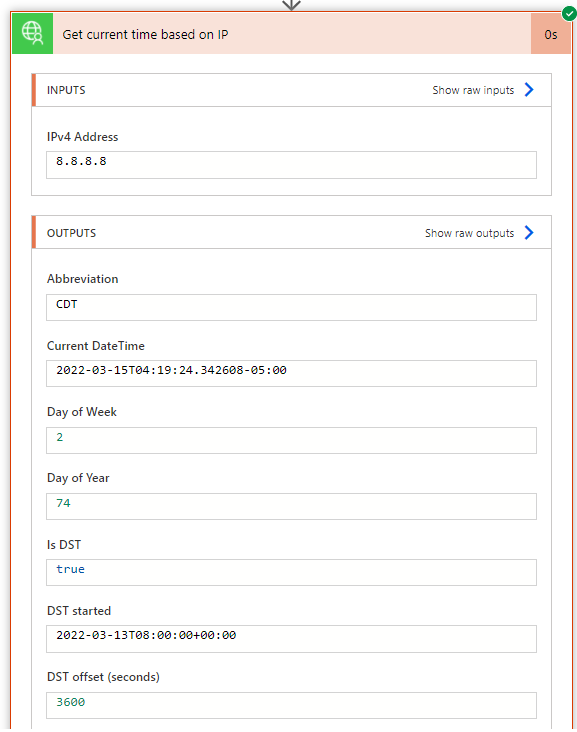

# WorldTimeAPI
WorldTimeAPI is a simple "microservice" which returns the local-time for a given timezone in both unixtime and ISO8601 format. Some additional information is provided, such as whether that timezone is currently in Daylight Savings Time, when DST starts and ends, the UTC offset, etc.

## Publisher: Fördős András

## Prerequisites
There are no prerequisites needed for this connector.

## Obtaining Credentials
This connector does not use authentication, so no credentials are needed.

## Supported Operations
### Get all TimeZones
Request a list of valid timezones.
### Get current time based on IP
Request the current time based on an IP. This is a "best guess" obtained from open-source data.
### Get timezone(s) of an area
Request a list of valid timezones for an area.
### Get timezone(s) of a location
Request list of timezones for a location.
### Get timezone(s) of a region
Request timezone for a region.

## Known Issues and Limitations
This API uses data from a number of sources, including IANA. It may be possible that a given IP has wrong data entry at the source itself.

Additionally, it is not recommended that this API be used for commercial applications. The API can go down from time-to-time, for relatively long periods. It is provided with no SLA, no guarantees, and no direct funding. Therefore, this API should not be used:

* in "real-time" situations where absolutely accurate timing data is required
* as an alternative to ntp
* as an alternative to calculating local time changes (eg. making a request every second)

## Example

