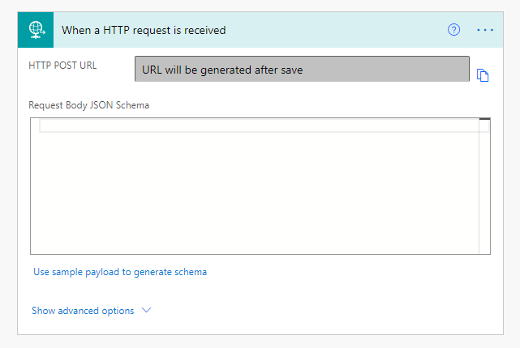
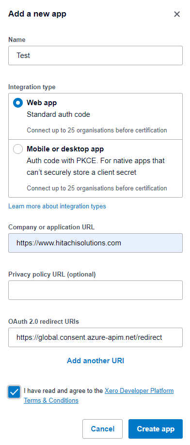

# Getting Started with Xero App webhooks
Currently, there is no API available that allows this custom connector to create triggers for flows. Start by creating a new Power Automate cloud flow using the 'When a HTTP request is received' trigger.

After you save the flow, an Azure HTTP POST URL will be created and you will use this with your Xero app webhook. You will then have to use the Xero My Apps UI to [create the webhook(s)](https://developer.xero.com/documentation/webhooks/creating-webhooks).

As there is only one notification URL allowed per app, to receive notifications about the second object you will need to create a second app.
